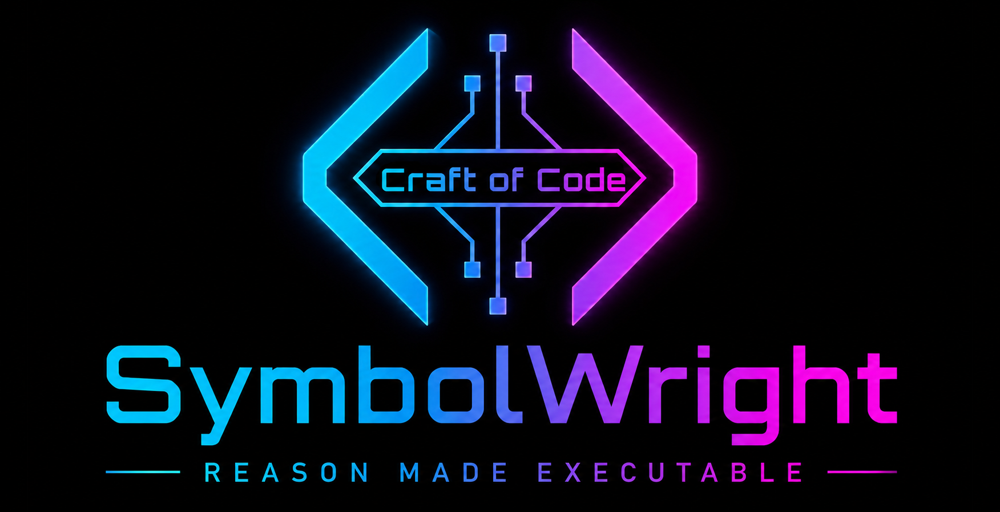

<p align="center">
  
</p>

<p align="center">
  <strong>Standalone AI coding-agent platform for repository intelligence, direct code work, PR review, and merge-readiness.</strong>
</p>

SymbolWright is a direct-capable coding-agent platform with optional governance and forensic review features. Its runtime strictness is controlled by the active runtime mode, not by a hardcoded read-only personality.

Ajna Review Cortex is the native forensic review capability. Ajna gives SymbolWright deterministic review, risk, evidence, and merge-readiness reporting when those workflows are requested or required.

## Codespaces Quick Start

Already in a GitHub Codespace (or any container with Node 20+)? Skip everything below and run:

```bash
npm run codespaces:start
```

This installs dependencies only if needed, builds current source, generates a local `SYMBOLWRIGHT_API_KEY` if you didn't set one, starts SymbolWright on port `8787`, waits for it to be healthy, and validates that the served browser JavaScript actually parses — then prints one summary with the real forwarded URL and the access key. From there:

1. Open the printed URL — it already points at `#/settings`.
2. Paste the printed **SymbolWright access key** into Settings.
3. Want AI-backed features instead of browser-only diagnostics? Set a provider key (e.g. `export ANTHROPIC_API_KEY=sk-ant-...`, see [`docs/PROVIDER_KEYS.md`](docs/PROVIDER_KEYS.md)) *before* running `codespaces:start`.
4. `npm run codespaces:stop` stops it; `npm run codespaces:status` reports whether it's healthy, which provider (if any) is detected, and where its logs are — no secrets in either.

Re-running `npm run codespaces:start` is also how you restart after changing code or env vars — no `Ctrl+C` needed. Full details, including the manual step-by-step path, are in [`docs/codespaces.md`](docs/codespaces.md).

## Getting Started

Install and build once:

```bash
npm install
npm run build
```

Set at least one provider credential (see [`docs/PROVIDER_KEYS.md`](docs/PROVIDER_KEYS.md) for the full list — OpenAI, Anthropic, Google Gemini, Groq, OpenRouter, GitHub Models, Ollama, DeepSeek, or a custom OpenAI-compatible endpoint):

```bash
export ANTHROPIC_API_KEY=sk-ant-...
```

Then pick how you want to use it — SymbolWright runs the same way from all four surfaces below:

**Terminal** — direct CLI usage:

```bash
node dist/cli.js agent --mode APPROVED_EXECUTION "fix the failing tests"
```

**Browser** — one app, one port: a Dashboard, the Universal Polyglot Workspace editor, and a chat/Agent tab with an "Agent mode" toggle for real file reads/edits and shell commands, all as tabs in the same page. No provider key required to get started — pick **Browser-only mode** in the Agent tab for local diagnostics only, or **API-backed mode** to bring your own provider key. Editing code in the Workspace tab and picking an AI task (explain, review, translate, ...) switches straight to the Agent tab with the draft pre-filled — no separate page or port:

```bash
export SYMBOLWRIGHT_API_KEY=pick-your-own-access-key
npm run serve
# open http://127.0.0.1:8787, connect with SYMBOLWRIGHT_API_KEY, choose Browser-only or API-backed mode
```

See [`docs/runtime/SYMBOLWRIGHT_CHAT_SERVER.md`](docs/runtime/SYMBOLWRIGHT_CHAT_SERVER.md). Running in GitHub Codespaces? Full copy-paste setup, port-forwarding, and troubleshooting steps are in [`docs/codespaces.md`](docs/codespaces.md).

**Any MCP-compatible LLM client** (Claude Desktop, Claude Code, other agent frameworks) — add SymbolWright as a plugin:

```json
{
  "mcpServers": {
    "symbolwright": { "command": "node", "args": ["/absolute/path/to/SymbolWright/dist/cli.js", "mcp-server"] }
  }
}
```

Defaults to `READ_ONLY`; add `"--mode", "APPROVED_EXECUTION"` to the `args` array to allow file writes and shell commands. See [`docs/runtime/SYMBOLWRIGHT_MCP_SERVER.md`](docs/runtime/SYMBOLWRIGHT_MCP_SERVER.md).

**Any other LLM, script, or agent framework over plain HTTP** — `symbolwright serve` also exposes `/api/chat` (streaming chat) and `/api/agent` (the full tool-execution loop) as bearer-authenticated HTTP+SSE endpoints. See [`docs/API_REFERENCE.md`](docs/API_REFERENCE.md) and [`docs/USING_SYMBOLWRIGHT_FROM_ANY_LLM.md`](docs/USING_SYMBOLWRIGHT_FROM_ANY_LLM.md).

## Current State

All 20 runtime phases (A–T) are complete. The platform supports scanning, context building, direct agent execution, proposal workflows, local file writes, validation, GitHub write preparation/execution, PR review, merge-readiness, handoff generation, and audit/trace replay.

`symbolwright status` reports runtime build state. `symbolwright doctor` validates workspace health. `symbolwright release-readiness` checks the release gates.

## Runtime Modes

SymbolWright uses one canonical runtime-mode set:

```txt
PLAN_ONLY
READ_ONLY
PROPOSAL_ONLY
APPROVED_EXECUTION
```

`APPROVED_EXECUTION` is the direct execution mode. It allows local writes, shell execution, validation commands, git operations, provider/network access, and GitHub writes when the matching credentials and tool surfaces are available.

`PLAN_ONLY`, `READ_ONLY`, and `PROPOSAL_ONLY` remain available when the operator wants non-mutating planning, inspection, or patch proposal behavior.

Mode selection:

```bash
symbolwright agent --mode APPROVED_EXECUTION "fix the failing tests"
symbolwright agent --mode READ_ONLY "inspect the repo for stale docs"
symbolwright agent --mode PROPOSAL_ONLY "draft the patch without applying it"
symbolwright agent --mode PLAN_ONLY "make a plan only"
```

Aliases:

```bash
symbolwright agent --approved "run direct implementation"
symbolwright agent --read-only "inspect only"
symbolwright agent --proposal-only "draft only"
symbolwright agent --plan-only "plan only"
```

Environment/config support:

```bash
SYMBOLWRIGHT_RUNTIME_MODE=APPROVED_EXECUTION
SYMBOLWRIGHT_RUNTIME_MODE=READ_ONLY
SYMBOLWRIGHT_RUNTIME_MODE=PROPOSAL_ONLY
SYMBOLWRIGHT_RUNTIME_MODE=PLAN_ONLY
```

The aliases `direct`, `off`, and `approved` normalize to `APPROVED_EXECUTION`. They do not create a second mode system.

## CLI Surface

The active CLI package is `symbolwright` and exposes:

```txt
symbolwright help
symbolwright status
symbolwright operator [mission]
symbolwright agent [--mode <mode>] [message]
symbolwright sessions
symbolwright index [dir]
symbolwright plan <goal>
symbolwright read <path>
symbolwright search <query>
symbolwright validation-plan [focus]
symbolwright propose-patch <goal>
symbolwright pr-notes [focus]
symbolwright pr-notes --fixture-file <json-file>
symbolwright ci-review [source]
symbolwright ci-review --fixture-file <json-file>
symbolwright runtime run <goal> --read-only
symbolwright live-read-policy <json-file>
symbolwright live-read-client-fixture <json-file>
symbolwright github-live-read <json-file>
symbolwright ajna-live-read <json-file>
symbolwright operator-review <json-file>
symbolwright write-intent <json-file>
symbolwright local-write <json-file>
symbolwright apply-patch <json-file>
symbolwright validation-command <json-file>
symbolwright pr-preparation <json-file>
symbolwright github-write-proposal <json-file>
symbolwright github-write-gate <json-file>
symbolwright github-write-executor <json-file>
symbolwright workflow <json-file>
symbolwright ajna-workflow <json-file>
symbolwright repair-loop <json-file>
symbolwright runtime-status
symbolwright project-context [dir]
symbolwright scan [dir]
symbolwright preflight [changed-file...]
symbolwright mission-packet <json-file>
symbolwright audit-ledger <json-file>
symbolwright trace-store <json-file>
symbolwright build-ledger
symbolwright doctor
symbolwright version
symbolwright release-readiness
symbolwright ajna scan-profile [dir]
symbolwright ajna docs
symbolwright ajna client-pipeline-manifest
symbolwright ajna client-pipeline-status
symbolwright ajna review-pr <json-file>
symbolwright ajna review-pr-github-fixture <json-file>
symbolwright ajna review-pr-github-api-fixture <json-file>
symbolwright ajna github-api-snapshot-fixture <json-file>
symbolwright ajna client-collector-fixture <json-file>
symbolwright ajna review-pr-client-collector-fixture <json-file>
symbolwright ajna merge-readiness-client-collector-fixture <json-file>
symbolwright ajna review-pr-collector-fixture <json-file>
symbolwright ajna review-pr-readonly-collector-fixture <json-file>
symbolwright ajna github-readonly-collector-fixture <json-file>
symbolwright ajna merge-readiness <json-file>
symbolwright serve [--host <host>] [--port <port>] [--cors-origin <origin>]
symbolwright mcp-server [--mode <mode>]
```

## Direct Agent Usage

Use the agent command for normal implementation work:

```bash
symbolwright agent --mode APPROVED_EXECUTION "implement the requested fix and validate it"
```

In direct mode, SymbolWright should prefer useful completed work over approval theater. It can still use Ajna, audit ledgers, and governance analysis when the task asks for forensic review, release proof, or merge-readiness evidence.

## Non-Mutating Workflows

Use these when you want planning or evidence without mutation:

```bash
symbolwright plan "add runtime mode docs"
symbolwright read README.md
symbolwright search runtime
symbolwright validation-plan "runtime activation"
symbolwright propose-patch "draft the change only"
symbolwright ci-review "local fixture"
```

The legacy `symbolwright runtime run` path remains a bounded read-only runtime workflow. It is separate from the direct `symbolwright agent` surface.

## Hard Safety Rails

Governance is optional by mode, but hard safety rails remain part of the runtime boundary:

```txt
workspace boundary enforcement
protected path blocking for .git, .env, .env.local, node_modules, dist, and coverage
secret redaction in audit/trace outputs
destructive shell-command blocking
sandboxed command execution with fail-closed behavior
protected branch and force-push blocking
GitHub write credential checks
bounded validation and release-readiness gates
```

These rails are not approval theater. They prevent accidental repo damage while keeping SymbolWright useful as a direct coding agent.

## Platform Capabilities

SymbolWright can:

```txt
understand repository structure
load project instructions
scan code and docs
plan implementation work
perform direct implementation through symbolwright agent
propose patches without applying them
write allowed local files
run validation commands
diagnose CI failures
prepare PR summaries
create and evaluate GitHub write operations
review pull requests
assess merge-readiness
coordinate specialized capabilities such as Ajna Review Cortex
support Codespaces/operator runbooks
record and replay audit trails with secret redaction
generate agent kernel mission handoff packets
validate workspace health and release readiness
recall and store durable episodic, lexical, and procedural memory across agent turns
run sandboxed PR preflight evidence checks and block pushes on regression
serve a real browser chat UI + HTTP API against any registered provider (`symbolwright serve`, see docs/runtime/SYMBOLWRIGHT_CHAT_SERVER.md)
run the real tool-execution agent loop over HTTP for Anthropic and any OpenAI-compatible provider, mode-gated (`POST /api/agent` on `symbolwright serve`)
run itself as a real MCP server so any MCP-compatible LLM client can use its tools as a plugin (`symbolwright mcp-server`, see docs/runtime/SYMBOLWRIGHT_MCP_SERVER.md)
```

Ajna remains evidence-first:

```txt
PR evidence schema
local collector fixtures
offline API payload adapter
collector snapshot contract
review-pr normalization
merge-readiness reporting
client pipeline manifest/status checks
live read adapters behind runtime policy checks
```

## Build and Validation

The repository is a TypeScript app using Vitest, ESLint, TypeScript, and npm scripts.

Primary validation commands:

```bash
npm run typecheck
npm test
npm run test:coverage
npm run lint
npm run audit
npm run build
npm run build:app
npm run release-readiness
```

Script map:

```txt
npm run typecheck     tsc -p tsconfig.json --noEmit
npm test              vitest run
npm run test:coverage vitest run --coverage
npm run lint          eslint src/
npm run audit         npm audit --omit=dev --audit-level=high
npm run build         tsc -p tsconfig.json
npm run build:app     npm run typecheck && npm run build
npm run validate      audit + typecheck + lint + format + coverage + build + release-readiness
```

## CI Strategy

Normal PR validation runs on Node 22 for one clear required signal. Node 20 and Node 22 compatibility proof lives in the separate `Node Compatibility` workflow, which can be run manually or on schedule.

## Current Foundation Docs

```txt
docs/migration/AELIB_SYMBOLWRIGHT_EXTRACTION_NOTES.md
docs/governance/SYMBOLWRIGHT_PERMISSION_MODEL.md
docs/governance/SYMBOLWRIGHT_THREAT_MODEL.md
docs/cli/SYMBOLWRIGHT_CLI_TERMINAL_UX_PLAN.md
docs/cli-plan-command.md
docs/runtime/SYMBOLWRIGHT_RUNTIME_FOUNDATION.md
docs/runtime/SYMBOLWRIGHT_RUNTIME_BUILD_STATE.md
docs/runtime/SYMBOLWRIGHT_RUNTIME_READONLY_COMMANDS.md
docs/runtime/SYMBOLWRIGHT_PROPOSAL_MODE.md
docs/runtime/SYMBOLWRIGHT_READONLY_LOOP.md
docs/runtime/SYMBOLWRIGHT_APPROVED_EXECUTION_GATES.md
docs/runtime/SYMBOLWRIGHT_READ_ADAPTERS.md
docs/runtime/SYMBOLWRIGHT_LIVE_READ_POLICY_HANDSHAKE.md
docs/runtime/SYMBOLWRIGHT_LIVE_READ_CLIENT_SEAM.md
docs/runtime/SYMBOLWRIGHT_GITHUB_LIVE_READ_ADAPTER.md
docs/runtime/SYMBOLWRIGHT_GITHUB_LIVE_READ_V1.md
docs/runtime/SYMBOLWRIGHT_AJNA_LIVE_READ_PIPELINE.md
docs/runtime/SYMBOLWRIGHT_OPERATOR_REVIEW_GATE.md
docs/runtime/SYMBOLWRIGHT_APPROVED_WRITE_PREPARATION.md
docs/runtime/SYMBOLWRIGHT_CONTROLLED_LOCAL_FILE_WRITE_GATE.md
docs/runtime/SYMBOLWRIGHT_APPROVED_VALIDATION_COMMAND_GATE.md
docs/runtime/SYMBOLWRIGHT_APPROVED_VALIDATION_EXECUTION.md
docs/runtime/SYMBOLWRIGHT_PR_PREPARATION.md
docs/runtime/SYMBOLWRIGHT_GITHUB_WRITE_PROPOSAL.md
docs/runtime/SYMBOLWRIGHT_APPROVED_GITHUB_WRITE_GATE.md
docs/runtime/SYMBOLWRIGHT_RUNTIME_WORKFLOW_COMPOSITION.md
docs/runtime/SYMBOLWRIGHT_AJNA_WORKFLOW_SURFACE.md
docs/runtime/SYMBOLWRIGHT_RUNTIME_STATUS_DASHBOARD.md
docs/runtime/SYMBOLWRIGHT_APPROVED_LOCAL_FILE_WRITES.md
docs/runtime/SYMBOLWRIGHT_SANDBOX_PRODUCTION_HARDENING.md
docs/runtime/SYMBOLWRIGHT_MCP_TOOL_RUNTIME.md
docs/runtime/SYMBOLWRIGHT_MCP_SERVER.md
docs/runtime/SYMBOLWRIGHT_WEB_TOOLS.md
docs/runtime/SYMBOLWRIGHT_CHAT_SERVER.md
docs/runtime/SYMBOLWRIGHT_CHECKPOINT_REWIND.md
docs/ajna/SYMBOLWRIGHT_AJNA_DOCS_HUB.md
docs/ajna/SYMBOLWRIGHT_AJNA_ROADMAP.md
docs/ajna/SYMBOLWRIGHT_AJNA_BUILD_PLAN.md
docs/build-state/SYMBOLWRIGHT_BUILD_LEDGER.md
docs/build-state/SYMBOLWRIGHT_FINAL_FORENSIC_AUDIT.md
docs/autonomy/AGENT_FORENSIC_PROCESS_DOCUMENTATION.md
docs/context/SYMBOLWRIGHT_PROJECT_CONTEXT_KERNEL.md
```

Some historical docs still use approval-era names because they describe earlier runtime phases or migration notes. Current behavior is controlled by the runtime mode selected for the active command.

## Relationship to AELIB-X1YA0I

SymbolWright was extracted from earlier AELIB-side coding-agent planning work, but it is now developed as its own standalone platform.

AELIB-X1YA0I may later integrate SymbolWright through a thin external adapter.

SymbolWright should be able to work on any authorized repository, not only AELIB-X1YA0I.

## Taglines

```txt
SymbolWright: Build. Fix. Understand.
Ajna: See beyond the code.
GitHub / PR Review: Expand your vision beyond the diff.
```
