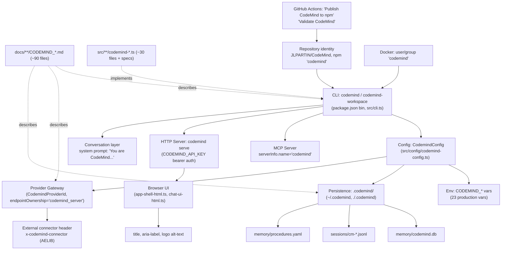

# CodeMind → SymbolWright Forensic Rebrand Audit

**Status:** Audit only. No rename performed. No production behavior changed.
**Prepared:** 2026-07-24
**Baseline repository:** `JLPARTIN/CodeMind` (package identity `jlpartin/codemind`)
**Baseline branch:** `claude/codemind-symbolwright-audit-rb61ht`
**Baseline commit:** `b8932b94005f1198b2cf8174b444e0d7b011054b`
**Working tree at baseline:** clean (no staged/unstaged changes, no untracked files)

---

## 1. Executive Summary

CodeMind is a ~1,185-tracked-file TypeScript monorepo (1,010 `.ts`, 121 `.md`,
plus JSON/YAML/Docker/CI config) implementing a standalone AI coding-agent
platform: a CLI (`codemind`), a unified browser app (`codemind serve`), an MCP
server (`codemind mcp-server`), and a large internal subsystem set (agent
runtime, memory, checkpoints, sandboxing, Ajna review, autonomy/mission
execution, provider gateway, GitHub integration).

The identity "CodeMind" is pervasive and multi-layered, not confined to
prose. It appears as: the npm package name and two CLI binary names; a live
MCP protocol handshake value; a custom HTTP header value; a runtime enum
value gating provider-adapter trust boundaries; ~208 internal TypeScript
declarations across ~30 files; a persisted local-state directory name
(`.codemind/`, both global `~/.codemind` and per-workspace) that is also
**already committed to git** in violation of the repo's own `.gitignore`; a
system-prompt string sent to the LLM itself; a browser `<title>`/ARIA-label;
~90 documentation filenames; a Docker container Unix user/group; and a GitHub
Actions job-name/publish-target identity.

695 of 1,185 tracked files (58.6%) contain a case-insensitive "codemind"
match; 3,838 individual lines match. No separator variant (`code-mind`,
`code_mind`, `code.mind`) exists anywhere — every occurrence is either the
concatenated form `CodeMind`/`Codemind`/`CODEMIND`/`codemind`, the `cm-`
abbreviation (used only as a session-ID prefix), or the enum value
`codemind_server`. This means the future rebrand is a comparatively
*mechanical* string-family rename with a **small number of genuinely
high-risk points**: the npm package/CLI identity, the MCP server name, one
external wire header, one runtime trust-boundary enum, the on-disk
persistence directory name, and the `CODEMIND_API_KEY` bearer-auth
environment variable. Everything else — the ~90 branded doc filenames, the
~30 branded source filenames, the ~208 internal type/const declarations, the
prose/system-prompt/UI text — is high-*volume* but low-to-medium risk,
because it is entirely internal to this repository and has no external
consumer.

This audit inventories every category the mission specified, assigns a
category/disposition/risk to each, and produces a phased execution plan a
future agent can follow without repeating discovery. **No file other than
this document was created or modified during this audit.**

## 2. Mission Scope and Non-Goals

**In scope:** discovery, classification, risk-rating, and planning for a
future CodeMind→SymbolWright rebrand across all source, config, docs,
assets, tests, fixtures, CI, persisted state, and externally-visible
identity this repository controls or references.

**Out of scope / explicitly not performed in this mission:**
- No renaming of any file, directory, package, command, environment
  variable, API, class, identifier, URL, workflow, asset, or user-facing
  text.
- No modification of `.codemind/` committed runtime-state files (documented,
  not touched).
- No repair of the unrelated `.gitignore`/tracked-file hygiene anomaly.
- No changes to GitHub repository settings, npm registry, GHCR, Codespaces,
  deployment targets, secrets, webhooks, or any other external system.
- No commits, pushes, or pull requests beyond this single new document.
- No temporary files left in the repository; no secrets reproduced.

## 3. Repository Baseline

| Property | Value |
|---|---|
| Repository (GitHub slug) | `JLPARTIN/CodeMind` |
| Package identity (`package.json`) | `jlpartin/codemind` (repo URL `https://github.com/jlpartin/codemind.git`) |
| Branch audited | `claude/codemind-symbolwright-audit-rb61ht` |
| HEAD commit | `b8932b94005f1198b2cf8174b444e0d7b011054b` |
| Working tree | Clean at start; at end, exactly one new untracked file (this document) |
| Tags / releases | None (`git tag -l` empty) |
| Commit count | 50 (`git log --oneline`) |
| Commits mentioning "codemind" (case-insensitive) | 16 |
| Commits mentioning "symbolwright" | 0 |
| Tracked files | 1,185 |
| Primary language | TypeScript (1,010 files), Markdown (121), JSON (21), JSONL (12), YAML (2) |
| Package manager / workspace | Single npm package, no monorepo/workspaces (`package.json`, `package-lock.json`) |
| Main entry points | `src/index.ts` (library export), `src/cli.ts` (CLI dispatcher, ~45 subcommands), `src/cli-bin.ts`/`src/cli-workspace-bin.ts` (bin shims), `src/mcp/mcp-server.ts` (MCP server), `src/server/codemind-chat-server.ts` (HTTP server for `codemind serve`) |
| Build command | `npm run build` (`tsc -p tsconfig.json`) |
| Test command | `npm test` (`vitest run`, includes `src/**/*.spec.ts`) |
| Validate command | `npm run validate` (audit → typecheck → lint → format:check → test:coverage → build → release-readiness) |
| CI workflows | `.github/workflows/ci.yml`, `publish.yml`, `deploy.yml`, `node-compatibility.yml` |
| Deployment target | GHCR container image (`.github/workflows/deploy.yml`), dynamically named from `${GITHUB_REPOSITORY,,}` |
| Package/binary identity | npm package `codemind`; CLI binaries `codemind`, `codemind-workspace` (`package.json` `bin`) |
| Local persistence root | `.codemind/` (global `~/.codemind`, per-workspace `<cwd>/.codemind`) |

## 4. Search Methodology

No single tool was relied upon. The following methods were used, in this
order, each cross-checking the last:

1. **Tracked-file, case-insensitive, whole-repo**: `git grep -liE 'codemind' -- .` / `git grep -ciE 'codemind' -- .` for file/line magnitude.
2. **Separator-variant sweep**: `git grep -liE 'code[-_. ]mind' -- .` (zero hits — ruled out a whole class of variants).
3. **Filename/directory-name-only search, independent of content**: `git ls-files | grep -iE 'codemind'` (147 hits) cross-checked against the content-based file list (695) — confirms filename matches are a strict subset of content matches, no orphan branded filenames with unbranded content or vice versa.
4. **Config-specific inspection**: full manual read of `package.json`, `tsconfig.json`, `eslint.config.js`, `vitest.config.ts`, `.prettierrc`, `Dockerfile`, `.dockerignore`, `.gitignore`, `.devcontainer/devcontainer.json`, all four `.github/workflows/*.yml`, `.github/pull_request_template.md`.
5. **Environment-variable-specific search**: `git grep -ohE "process\.env\.[A-Z_0-9]+"` and `git grep -ohE "process\.env\['[A-Z_0-9]+'\]"` across `src/` to separate *real* env-var reads from doc-title-derived false matches (a naive `[A-Z_]*CODEMIND[A-Z_]*` sweep over `.md` files produced ~90 tokens, the great majority of which are Markdown filenames like `CODEMIND_MCP_SERVER`, not environment variables).
6. **AST/symbol-aware inspection**: targeted greps for `class Codemind`, `interface Codemind`, `type Codemind`, `function.*[Cc]odemind`, `const.*CODEMIND` across `src/`, directory-by-directory, to enumerate internal code symbols distinct from string literals.
7. **Asset inspection**: `file`/`md5sum`/size comparison of both logo copies; grep for `.svg`, `manifest.json`, `og:`, `apple-touch-icon`, `favicon` to confirm absence of PWA/social-preview/favicon assets.
8. **Generated-output source tracing**: traced `CODEMIND_PLATFORM_NAME` (single source constant in `src/codemind-foundation.ts`) forward through its two consumers (`cli-version.ts`, `cli-commands.ts`) to confirm no independent duplicate literal exists for the CLI's own self-reported name.
9. **Runtime-facing output inspection**: read `src/conversation/system-prompt-builder.ts` and `unified-system-prompt.ts` (text sent to the LLM), `src/app/shell/app-shell-html.ts` and `src/server/chat-ui-html.ts` (browser-rendered HTML), `src/telemetry/cost-tracker.ts` (CLI-rendered report headers).
10. **Test and snapshot inspection**: grep across all `*.spec.ts` for `toBe('codemind'|'CodeMind')` / `toContain(...)` style assertions, separating cosmetic-string tests from machine-contract tests (`package-contract.spec.ts`, `mcp-server-protocol.spec.ts`).
11. **Git history and external-identity review**: `git tag -l`, `git branch -a`, `git log --oneline -i --grep='codemind'`, `git remote -v`; `.devcontainer/devcontainer.json`'s Codespaces repository-permission block enumerated as the sibling-repository dependency list.
12. **Manual review of likely branding hubs regardless of grep hits**: README.md, CHANGELOG.md, `docs/build-state/*`, `docs/autonomy/*` read in full or in representative part to confirm historical-vs-active status by tense and content (not filename alone).
13. **Second-round derivative search**: after round one, new terms discovered (`cm-` session prefix, `codemind_server` enum, `x-codemind-connector` header, `codemind-workspace`, `CodeMindMission`/`CodeMindPlan` capital-M variant, `CODEMIND_MD` vs `'CODEMIND.md'` literal) were each re-searched individually to confirm full extent (see §5).
14. **Two independent read-only research agents** were used in parallel to cross-verify subsystem coverage (internal symbols; docs/UI/fixtures/tests) — their raw findings were reconciled against my own direct greps before being written into this document; no agent output was transcribed verbatim without verification against the cited file.

Representative reproducible commands are consolidated in **Appendix A**.

## 5. Search Variants and Derived Terms

| Variant searched | Result |
|---|---|
| `CodeMind`, `Codemind`, `CODEMIND`, `codemind` | 695 files / 3,838 lines (case-insensitive superset) |
| `Code Mind`, `code mind`, `CODE MIND` | 0 hits |
| `code-mind`, `Code-Mind`, `CODE-MIND`, `code_mind`, `Code_Mind`, `CODE_MIND`, `code.mind`, `Code.Mind`, `CODE.MIND` | 0 hits — no separator-variant naming exists |
| `codemind-`, `-codemind`, `codemind_`, `_codemind`, `codemind.`, `.codemind` | All present; `.codemind` (leading-dot) is the persistence directory, `codemind-` is the dominant filename/identifier prefix |
| `cm` / `CM` as a bare token | 150 raw hits, manually reviewed — the only CodeMind-derived instance is the `cm-<epoch>` session-ID prefix in `.codemind/sessions/*.jsonl`; all other `cm`/`CM` hits are unrelated (e.g. `cm` as a unit abbreviation in unrelated prose, `CM` in acronyms belonging to other domains) — classified **FALSE_POSITIVE** individually, see §21 |
| `CODEMIND_API_KEY` | Real, live env var (§11) |
| `CodeMindAgent`, `CodeMindServer`, `CodeMindClient`, `CodeMindWorkspace`, `CodeMindMission`, `CodeMindConfig`, `CodeMindError`, `CodeMindRuntime` | `CodeMindMission` (mission subsystem, capital-M variant) and `CodemindError`/`CodemindConfig`/`CodemindRuntimeMode` (lowercase-m variant) both exist; `CodeMindAgent`/`CodeMindServer`/`CodeMindClient`/`CodeMindWorkspace` as literal identifiers do not exist verbatim but conceptually correspond to `codemind-agent-*.ts`, `codemind-chat-server.ts`, `CodemindGithubReadClient`, `CodemindBrowserWorkspaceContract` |
| `codemind-cli`, `codemind-api`, `codemind-server`, `codemind-agent`, `codemind-workspace`, `codemind-dashboard` | `codemind-workspace` is real (CLI binary + `command:` literal, 18 occurrences); the others do not exist as literal tokens but the *concepts* map onto `src/cli.ts`, `src/app/api/*`, `src/server/codemind-chat-server.ts`, `src/runtime/loop/codemind-agent-loop.ts`, `src/app/shell/*` respectively |
| `codemind.dev`, `codemind.ai` | 0 hits — no such domains referenced anywhere in the repo |
| `JLPARTIN/CodeMind`, `github.com/JLPARTIN/CodeMind` | Present in `.devcontainer/devcontainer.json` (as itself is not listed, only siblings are), fixtures/examples (sample GitHub API payloads), and is the actual repo slug |
| **New terms derived mid-audit and re-searched:** `codemind_server` (12 hits, 1 source + 1 test), `x-codemind-connector` (2 hits, 1 source + 1 test), `cm-` prefix (12 committed session files + generator logic), `CodeMindMission`/`CodeMindPlan` (capital-M convention, ~40 occurrences across mission/plan subsystem — would be **missed** by a strict lowercase-`Codemind` regex, caught only by full case-insensitive `codemind` search), `CODEMIND_MD` enum member vs. independent literal `'CODEMIND.md'` in `src/context/project-instructions.ts:3`, `CODEMIND_*_BLOCK_ID` traceability-constant family (11 distinct constants, one per contract/proof file) | All re-searches confirmed no further undiscovered variant families; see §13 for the full second-round methodology note |

No dynamically-constructed/split form of "CodeMind" that would evade a
case-insensitive search was found (e.g. no `'Code' + 'Mind'` concatenation,
no `btoa('Q29kZU1pbmQ=')`-style encoding, no per-character array join). The
one true "constructed" case is `CODEMIND_PLATFORM_NAME` (source constant) →
interpolated into two output strings (§13, §22) — this is captured by
plain-text search at both ends (declaration and interpolation site both
contain the literal string).

## 6. Architecture and Branding Surface Map



Five layers carry the identity, in order of external-facing risk:
1. **External contracts** (repo slug, npm package, MCP handshake, connector
   header, provider-trust enum) — changing these affects anyone/anything
   outside this repository.
2. **Runtime/persistence** (`.codemind/`, env vars, config resolution order)
   — changing these affects every existing local install and CI job.
3. **Internal code identity** (declarations, filenames, imports) — changing
   these affects only this repository's own build/compile step.
4. **User-facing text** (CLI banners, browser titles, system prompt, docs)
   — changing these is cosmetic but user-visible.
5. **Historical record** (CHANGELOG, forensic-audit docs, git history) —
   should largely not change at all.

## 7. Master Reference Inventory

Grouping rule applied: rows are grouped only when every member has identical
meaning, disposition, risk, and migration treatment; full path enumeration
for every grouped row is in **Appendix B**.

| ID | Current Value | Proposed SymbolWright Value | File/External Location | Line/Region | Category | User-Facing? | Runtime-Critical? | Public Contract? | Persistence Impact? | Generated? | Source of Truth | Disposition | Risk | Validation Needed |
|---|---|---|---|---|---|---|---|---|---|---|---|---|---|---|
| INV-01 | GitHub repo slug `JLPARTIN/CodeMind` | `JLPARTIN/SymbolWright` (or lowercase `symbolwright`) | GitHub repository settings (external) | n/a | B | Yes | No | Yes (clone URLs, issue links) | No | No | GitHub repo settings | UPDATE_EXTERNAL_SYSTEM | CRITICAL | Confirm GitHub auto-redirect from old slug; verify all workflow/package URLs still resolve |
| INV-02 | npm package name `codemind` (`package.json:2`) | `symbolwright` (or scoped `@symbolwright/cli`) | `package.json:2`, `package-lock.json` (name field), `src/package-contract.spec.ts:66` | 2 | C | No | Yes | Yes (npm registry identity) | No | No | `package.json` | RENAME_WITH_COMPATIBILITY_ALIAS | CRITICAL | Publish new package name; consider deprecating old npm name with a stub pointing to the new one; update `package-contract.spec.ts` in lockstep |
| INV-03 | CLI binary `codemind` (`package.json` bin) | `symbolwright` | `package.json:19`, `src/cli.ts`, `src/cli-bin.ts`, `src/package-contract.spec.ts:88` | 19 | C/E | Yes | Yes | Yes (existing installs invoke `codemind`) | No | No | `package.json` bin map | RENAME_WITH_COMPATIBILITY_ALIAS | CRITICAL | Ship both `codemind` and `symbolwright` bin entries for a deprecation window; `codemind` prints a one-line deprecation notice then delegates |
| INV-04 | CLI binary `codemind-workspace` | `symbolwright-workspace` | `package.json:20`, `src/cli-workspace.ts:134`, `src/cli-workspace-bin.ts` | 20, 134 | C/E | Yes | Yes | Yes | No | No | `package.json` bin map | RENAME_WITH_COMPATIBILITY_ALIAS | HIGH | Same alias strategy as INV-03 |
| INV-05 | MCP `serverInfo.name: 'codemind'` | `serverInfo.name: 'symbolwright'` | `src/mcp/mcp-server.ts:25` (`DEFAULT_SERVER_INFO`) | 25 | E | No | Yes | Yes (protocol handshake, external MCP clients may match on this) | No | No | `mcp-server.ts` | RENAME_WITH_COMPATIBILITY_ALIAS | CRITICAL | See §12 reasoning block; validate against real MCP clients (Claude Desktop, Claude Code) before removing back-compat |
| INV-06 | Header `x-codemind-connector` (value `AELIB_CONNECTOR_ID`) | `x-symbolwright-connector` | `src/aelib/aelib-connector.ts:144` | 144 | E/M | No | Yes | Yes (consumed by external AELIB system) | No | No | `aelib-connector.ts` | UPDATE_EXTERNAL_SYSTEM | CRITICAL | Coordinate with AELIB-side consumer before changing; consider sending both headers during transition |
| INV-07 | Enum value `endpointOwnership: 'codemind_server'` | `endpointOwnership: 'symbolwright_server'` | `src/providers/provider-adapter-contract.ts:30,70,83,93,103,113,123,132,142,154,174`; asserted `src/api/universal-api-contract.spec.ts:69` | 30 (+10 more) | E/F | No | Yes | Semi-public (internal API contract type, exported via `src/universal-api.ts`) | No | No | `provider-adapter-contract.ts` | RENAME_DIRECTLY (internal-only, but coordinate with test) | HIGH | Update all 9 adapter definitions + the assertion in the same commit; typecheck will catch any miss since it's a literal union type |
| INV-08 | `.codemind/` persistence directory (global `~/.codemind`, per-workspace `./.codemind`) | `.symbolwright/` | `src/storage/storage-paths.ts:14-15` (canonical resolver) + 27 other files hardcoding the `'.codemind'` literal directly (see Appendix B) | 14-15 | D/K | Indirectly (visible in user's home dir / repo tree) | Yes | No (local-only) | Yes — existing users have data here | No | `storage-paths.ts` is the *intended* source of truth, but is not universally used | MIGRATE_PERSISTED_VALUE | CRITICAL | Ship a one-time migration that copies `~/.codemind` → `~/.symbolwright` (and per-workspace equivalent) on first run of the new binary, with old-path fallback read for one deprecation window; consolidate all 27 hardcoded literals to import from `storage-paths.ts` *before* the rename lands, so the rename touches one file |
| INV-09 | `.codemind/memory/codemind.db` (committed) | `.symbolwright/memory/symbolwright.db` (new default); committed copy handling per §15 | `.codemind/memory/codemind.db` | n/a | K/L | No | No | No | Yes | Yes (runtime-generated, accidentally committed) | Should not exist in git at all | REVIEW_MANUALLY | HIGH | See §15 "Persisted-State Anomaly" — schema-only, empty, no secrets, but is a repo-hygiene defect independent of the rebrand |
| INV-10 | Committed `.codemind/sessions/cm-*.jsonl` (12 files) | N/A — these are local runtime artifacts, not product identity | `.codemind/sessions/cm-1784569416770.jsonl` through `cm-1784570264785.jsonl` (12 files, full list Appendix B) | n/a | K/L | No | No | No | Yes | Yes | Should not exist in git | REVIEW_MANUALLY | MEDIUM | Confirmed trivial content (`"hello"`/`"done"` test messages), no secrets; recommend removal from version control as a *separate* hygiene commit, not bundled into the rebrand |
| INV-11 | `cm-` session-ID prefix | `sw-` (or a non-brand-derived scheme, e.g. ULID) | `.codemind/sessions/cm-*.jsonl` filenames + in-file `sessionId` field; generator site not exhaustively located in this pass | n/a | D/K | No | Yes (used as the on-disk session key) | No | Yes | Yes (generated at session-create time) | Session-ID generator (exact file not pinned down this pass — flag for manual confirmation, likely in `src/memory/agent-memory-session.ts` or `src/mission/mission-store.ts`) | MIGRATE_PERSISTED_VALUE | MEDIUM | Locate generator before rebrand implementation; old-prefixed session files must remain loadable (read-compat) even after the prefix changes |
| INV-12 | `CodemindConfig` / `CodemindConfigSources` / `resolveCodemindConfig` / `validateCodemindConfig` | `SymbolWrightConfig` / … | `src/config/codemind-config.ts` (whole file, 20+ exports) | 1-220 | F | No | Yes | No (internal) | No | No | `codemind-config.ts` | RENAME_DIRECTLY | LOW | Full-file rename + all ~15 importers; typecheck catches misses |
| INV-13 | `src/config/codemind-config.ts` filename | `src/config/symbolwright-config.ts` | filename | n/a | G | No | No | No | No | No | n/a | RENAME_DIRECTLY | LOW | Update all import paths |
| INV-14 | `CODEMIND_API_KEY` (bearer auth for `codemind serve`) | `SYMBOLWRIGHT_API_KEY` | `src/cli-serve.ts:76`, `src/server/codemind-chat-server.ts:122,156-159`, `src/server/chat-ui-html.ts:59`, `src/app/views/settings-view.ts:12`, README.md example, `docs/PROVIDER_KEYS.md` | 76; 122 | D/E | Yes (users set this env var and see it in the UI) | Yes (gates every authenticated `/api/*` route) | Semi-public (documented, user-configured secret name) | No | No | `cli-serve.ts` reads it; UI labels reference it | RENAME_WITH_COMPATIBILITY_ALIAS | CRITICAL | Dual-read `SYMBOLWRIGHT_API_KEY` first, `CODEMIND_API_KEY` fallback with a startup deprecation warning; document conflict precedence (see §23) |
| INV-15 | Other production `CODEMIND_*` env vars (19 more — full list §11/Appendix B) | `SYMBOLWRIGHT_*` equivalents | Various — see §11 table | Various | D | No (mostly operator-facing, some tests) | Yes | No (internal config only) | No | No | Each var's own read-site | RENAME_WITH_COMPATIBILITY_ALIAS | HIGH | Same dual-read pattern as INV-14, batched; update `docs/PROVIDER_KEYS.md` which is already missing several of these even today (pre-existing doc gap) |
| INV-16 | Dynamic `CODEMIND_PROVIDER_<ID>_DISABLED` | `SYMBOLWRIGHT_PROVIDER_<ID>_DISABLED` | `src/providers/provider-config.ts:91` | 91 | D | No | Yes | No | No | No (pattern, not literal) | `provider-config.ts` | RENAME_WITH_COMPATIBILITY_ALIAS | MEDIUM | Pattern-based env lookup — update the prefix string, keep dual-read |
| INV-17 | `appState.codemindKey` client-state field + storage key `codemind_api_key` + DOM id `settings-codemind-key`/`codemind-key` | `appState.symbolWrightKey`, `symbolwright_api_key`, `settings-symbolwright-key` | `src/app/views/checkpoints-view.ts:18,42`; `dashboard-view.ts:29`; `tools-view.ts:23`; `autonomy-view.ts:21`; `missions-view.ts:81`; `memory-view.ts:26`; `repository-view.ts:92`; `settings-view.ts:12`; `src/server/chat-ui-html.ts:53-70` | Various | F/K | Yes (browser localStorage key visible to power users via devtools) | Yes (drives every authenticated fetch from the browser UI) | No | Yes (browser localStorage) | No | `settings-view.ts` | MIGRATE_PERSISTED_VALUE | HIGH | Existing browsers have `codemind_api_key` in localStorage; read-migrate to the new key on first load of the new UI, do not silently drop the stored key |
| INV-18 | `CodemindProviderId` type + `CODEMIND_SUPPORTED_PROVIDER_IDS` + `CODEMIND_PROVIDER_ADAPTER_BLOCK_ID` + `CODEMIND_PROVIDER_ADAPTERS` | `SymbolWrightProviderId`, etc. | `src/providers/provider-adapter-contract.ts` (whole file) | 1-220 | F | No | Yes | Type only re-exported via `src/universal-api.ts:37` (semi-public library export) | No | No | `provider-adapter-contract.ts` | RENAME_DIRECTLY | MEDIUM | If `src/universal-api.ts` is a published type surface (it is exported from the package's `./universal-api` entrypoint per `package.json` exports), treat the exported type name as a minor public-API break — note in CHANGELOG under the new major version |
| INV-19 | `CODEMIND_*_BLOCK_ID` traceability-constant family (11 constants: `CODEMIND_PROVIDER_ADAPTER_BLOCK_ID`, `CODEMIND_UNIVERSAL_API_BLOCK_ID`, `CODEMIND_BROWSER_WORKSPACE_BLOCK_ID`, `CODEMIND_AJNA_PROOF_MATRIX_BLOCK_ID`, `CODEMIND_GITHUB_ADAPTER_PROOF_BLOCK_ID`, `CODEMIND_GOVERNANCE_PROOF_BLOCK_ID`, `CODEMIND_KERNEL_TRACE_PROOF_BLOCK_ID`, `CODEMIND_PROOF_HARNESS_BLOCK_ID`, `CODEMIND_PROOF_REPORT_RENDERER_BLOCK_ID`, `CODEMIND_REPO_CONTEXT_PROOF_BLOCK_ID`, `CODEMIND_RUNTIME_BOUNDARY_PROOF_BLOCK_ID`) | `SYMBOLWRIGHT_*_BLOCK_ID` | One constant per contract/proof file under `src/providers/`, `src/api/`, `src/workspace/`, `src/testing/` (full list Appendix B) | Various | F | No | No (internal traceability tags only) | No | No | Each file defines its own | RENAME_DIRECTLY | LOW | Purely cosmetic internal IDs; safe to batch-rename with a script + typecheck |
| INV-20 | `CodeMindMission` / `assertCodeMindMission` / `CodeMindPlan` / `buildCodeMindPlan` (capital-M variant) | `SymbolWrightMission`, `SymbolWrightPlan` | `src/mission/mission-types.ts:103`, `mission-validation.ts:237`, `src/cli-plan.ts:1,9,42`, plus consumers `mission-store.ts`, `mission-service.ts`, `mission-migration.ts`, `codemind-chat-server.ts:54`, `mission-autonomy-edit-executor.ts:7` | 103; 237; 1,9,42 | F | No | Yes | No | No (type only) | No | `mission-types.ts` / `cli-plan.ts` | RENAME_DIRECTLY | MEDIUM | Flag: a strict `Codemind` (lowercase-m) regex misses this ~40-occurrence family; any rebrand tool must search case-insensitively, not just for the `Codemind` casing used elsewhere |
| INV-21 | System-prompt text `'You are CodeMind, an AI coding agent...'` and `'You are CodeMind — an autonomous coding agent operating within the AELIB-X1YA0I ecosystem.'` | `'You are SymbolWright, ...'` | `src/conversation/system-prompt-builder.ts:16`, `src/conversation/unified-system-prompt.ts:45` | 16; 45 | A | Yes (model-facing, indirectly shapes model self-identification in responses) | Yes | No | No | No | Both files | RENAME_DIRECTLY | MEDIUM | Update in lockstep with `system-prompt-builder.spec.ts:8` / `unified-system-prompt.spec.ts:8` which assert `toContain('CodeMind')`; also references the sibling "AELIB-X1YA0I ecosystem" — do not alter that unrelated name |
| INV-22 | Browser `<title>CodeMind</title>` / `aria-label="CodeMind navigation"` | `<title>SymbolWright</title>` / `aria-label="SymbolWright navigation"` | `src/app/shell/app-shell-html.ts:105`, `src/app/views/nav-shell-view.ts:26` | 105; 26 | A | Yes | No | No | No | No | Both files | RENAME_DIRECTLY | LOW | Straightforward text/attribute swap |
| INV-23 | `<title>CodeMind Chat</title>`, `<h1>CodeMind Chat</h1>`, label "CodeMind access key (CODEMIND_API_KEY)", placeholder "paste your CodeMind API key" | `SymbolWright Chat`, updated label/placeholder referencing `SYMBOLWRIGHT_API_KEY` | `src/server/chat-ui-html.ts:53-70,146` | 53-70; 146 | A | Yes | No | No | No | No | `chat-ui-html.ts` | RENAME_DIRECTLY | LOW | Update alongside INV-14's env var rename so the label matches the real var name |
| INV-24 | `assets/codemind-logo.png` + duplicate `assets/assets/codemind-logo.png` (byte-identical, 995,466 bytes, md5 `b59e7671d83a61c0c18c0fa01e82c2ac`) | New `symbolwright-logo.png` (single copy; drop the duplicate) | `assets/codemind-logo.png`, `assets/assets/codemind-logo.png`, referenced `README.md:2` (`alt="CodeMind"`) | n/a | H | Yes | No | No | No | No (binary asset, no editable source found in-repo) | No source file exists in-repo — must be recreated/redesigned externally | REGENERATE_FROM_SOURCE | LOW | New logo must be produced outside this repo (no vector/source found); also fix the pre-existing duplicate-file issue while touching this path |
| INV-25 | `POLICY_ID = 'codemind-default-permission-policy'`, pattern string `'codemind.policy'` | `symbolwright-default-permission-policy`, `symbolwright.policy` | `src/permissions/codemind-permission-policy.ts:9,58` | 9; 58 | F | No | Yes (policy-id used as a lookup key) | No | Possibly (if persisted in any policy-override file — not confirmed) | No | `codemind-permission-policy.ts` | RENAME_DIRECTLY (confirm no persisted override references the old ID first) | MEDIUM | Grep any user-supplied policy-override config for the old ID string before removing read support |
| INV-26 | `CODEMIND_MD` enum member vs. independent literal `'CODEMIND.md'` | `SYMBOLWRIGHT_MD` enum member; project-instructions filename convention `SYMBOLWRIGHT.md` (alongside `CLAUDE.md`, `AGENTS.md`) | `src/permissions/codemind-permission.types.ts:47`, `src/context/project-instructions.ts:3` | 47; 3 | F/A | Yes (repo-owner-facing: a `CODEMIND.md` file convention like `CLAUDE.md`) | Yes (read from target repos being analyzed) | No | Reads from *other* repositories' root, not this repo's own state | No | Two independent literals for one concept | RENAME_WITH_COMPATIBILITY_ALIAS | MEDIUM | Continue recognizing a legacy `CODEMIND.md` file in analyzed target repos indefinitely (this reads *other people's* repos — a permanent alias, not a deprecation window) |
| INV-27 | ~90 `docs/**/CODEMIND_*.md` and `docs/USING_CODEMIND_FROM_ANY_LLM.md` filenames (69 in `docs/runtime/`, 5 in `docs/build-state/`, 3 in `docs/ajna/`, 1 each in `docs/cli/`, `docs/context/`, `docs/governance/`×2, `docs/kernel/`, `docs/providers/`, `docs/USING_CODEMIND_FROM_ANY_LLM.md`) | `docs/**/SYMBOLWRIGHT_*.md` | See Appendix B for full enumeration | n/a | H | No (internal engineering docs) | No | No | No | No | Each doc describes its own subsystem | UPDATE_DOCUMENTATION_ONLY (active docs) / KEEP_HISTORICAL (the 5 in `docs/build-state/` and 4 in `docs/autonomy/` — see §18) | LOW | Batch rename + content find/replace; historical subset excluded, see INV-32 |
| INV-28 | ~30 `src/**/codemind-*.ts` + ~26 matching `.spec.ts` source filenames | `src/**/symbolwright-*.ts` | See Appendix B for full enumeration | n/a | G/F | No | Yes (these are real modules, not just docs) | No | No | No | Each file | RENAME_DIRECTLY | MEDIUM | Renaming ~56 files touches every importer; do as one atomic commit with `tsc --noEmit` as the gate, not incrementally |
| INV-29 | Docker `addgroup -S codemind && adduser -S codemind -G codemind` / `USER codemind` | `symbolwright` Unix user/group | `Dockerfile:21-22` | 21-22 | J | No (operationally invisible externally) | No | No | No | No | `Dockerfile` | RENAME_DIRECTLY | LOW | Rebuild and verify container still runs as non-root |
| INV-30 | GHCR image identity (dynamically derived `${GITHUB_REPOSITORY,,}`) | Auto-follows GitHub repo rename (INV-01) | `.github/workflows/deploy.yml:54` | 54 | J | No | No | Yes (deployment target) | No | Yes (derived at workflow run time) | GitHub repo name itself | REGENERATE_FROM_SOURCE (no code change needed — follows INV-01 automatically) | MEDIUM | After the GitHub repo rename, confirm the next `deploy.yml` run pushes to the new GHCR path and update any external references (e.g. Kubernetes manifests) that pin the old path — those live outside this repo |
| INV-31 | `.github/workflows/publish.yml` job "Publish CodeMind to npm"; `ci.yml` job "Validate CodeMind"; temp file `/tmp/codemind-changed-files.txt` | "Publish SymbolWright to npm"; "Validate SymbolWright"; `/tmp/symbolwright-changed-files.txt` | `publish.yml:43`, `ci.yml:18,60,62,67` | 43; 18,60,62,67 | J | No (CI job display names) | No | No | No | No | Each workflow file | RENAME_DIRECTLY | LOW | Cosmetic CI display names; temp file path is process-local only |
| INV-32 | `CHANGELOG.md` (dated historical entries, ~30+ mentions of "CodeMind"/`codemind`) | No rewrite of existing entries; new entries reference SymbolWright going forward, optionally with a one-line rename notice | `CHANGELOG.md` | Throughout | L | Yes | No | No | No | No | n/a | KEEP_HISTORICAL | NONE | Confirm no CI/tooling parses CHANGELOG.md programmatically for the string "CodeMind" (none found) |
| INV-33 | `docs/build-state/CODEMIND_*.md` (5 files) + `docs/autonomy/{BUNDLE6,BUNDLE7,POST_BUNDLE6,POST_BUNDLE7}*.md` (4 files) + `docs/build-plans/LPRB-CM-SAVANT-PR-FORENSICS-01.md` | Preserve as historical; do not rewrite retroactively; optionally add a "predates the SymbolWright rename" preface | `docs/build-state/*`, `docs/autonomy/*`, `docs/build-plans/*` | n/a | L | No | No | No | No | No | n/a | KEEP_HISTORICAL | NONE | Confirmed by direct reading: these narrate closed, dated, PR-numbered/commit-SHA-referenced past work, not active instructions |
| INV-34 | `docs/migration/AELIB_CODEMIND_EXTRACTION_NOTES.md` | Keep filename as a historical migration record OR rename with an explicit "formerly" cross-reference — manual call | `docs/migration/AELIB_CODEMIND_EXTRACTION_NOTES.md` | n/a | L | No | No | No | No | No | n/a | REVIEW_MANUALLY | LOW | Content not fully read this pass — confirm whether it documents a completed one-time extraction (→ KEEP_HISTORICAL) or standing integration guidance (→ rename) before the rebrand implementation |
| INV-35 | `src/mcp/mcp-server-protocol.spec.ts:9` asserting `{ name: 'codemind', version: '0.1.0' }` | Update to `{ name: 'symbolwright', version: <next> }` in the same commit as INV-05 | `src/mcp/mcp-server-protocol.spec.ts:9` | 9 | I | No | No | Test only, but guards a public contract | No | No | n/a | RENAME_DIRECTLY (paired with INV-05) | HIGH | This test is the regression guard for the MCP handshake — must change atomically with the server code, never independently |
| INV-36 | `src/package-contract.spec.ts:66,88-89` asserting `pkg.name==='codemind'`, `pkg.bin['codemind']`, `pkg.bin['codemind-workspace']` | Update to assert the new package/bin names | `src/package-contract.spec.ts:66,88-89` | 66; 88-89 | I | No | No | Test only, guards npm/CLI identity | No | No | n/a | RENAME_DIRECTLY (paired with INV-02/03/04) | HIGH | Same atomicity requirement as INV-35 |
| INV-37 | `src/cli-version.spec.ts:13`, `src/cli-commands.spec.ts:257`, `src/cli-doctor.spec.ts:36`, `src/cli-scan.spec.ts:66`, `src/cli-runtime-read.spec.ts:15` (cosmetic `toContain`/`toBe` assertions on the platform-name string) | Update to the new platform name | Each listed file | Various | I | No | No | No (cosmetic display string, not a wire contract) | No | No | `codemind-foundation.ts`'s `CODEMIND_PLATFORM_NAME` | RENAME_DIRECTLY | LOW | Batch-updatable alongside INV-21/INV-22 |
| INV-38 | `fixtures/mcp/fixture-server.mjs` `SERVER_NAME = 'codemind-fixture-server'` | `symbolwright-fixture-server` (test-only identity) | `fixtures/mcp/fixture-server.mjs:16` | 16 | I | No | No | No (test fixture only) | No | No | n/a | RENAME_DIRECTLY | LOW | Update alongside its consuming spec |
| INV-39 | `fixtures/github-write-executor-fixture.json`, `fixtures/github-live-read-fixture.json`, `examples/ajna/*.json` embedding `"repository": "JLPARTIN/CodeMind"` / `"repo": "codemind"` / `"name": "Validate CodeMind"` | Update only *after* the real GitHub repo/CI job rename happens (INV-01/INV-31), so fixtures stay truthful to the real upstream at all times | `fixtures/github-*-fixture.json`, `examples/ajna/*.json` (full list Appendix B) | n/a | I | No | No | No — these are sample data representing the real repo, not the product's own brand | No | No | Real GitHub repo/CI state | UPDATE_DOCUMENTATION_ONLY (deferred until INV-01 executes) | LOW | Do not rename these ahead of the actual GitHub repo rename — they would become factually wrong fixtures |
| INV-40 | `fixtures/project-context-fixture.json:2` description text mentioning "codemind project-context command" | Update to match new CLI command prefix | `fixtures/project-context-fixture.json:2` | 2 | I | No | No | No | No | No | n/a | UPDATE_DOCUMENTATION_ONLY | NONE | Purely descriptive fixture comment |
| INV-41 | `docs/PROVIDER_KEYS.md` under-documents several real `CODEMIND_*` vars (pre-existing gap, independent of rebrand) | N/A this audit; flagged for the doc owner | `docs/PROVIDER_KEYS.md` | n/a | H | Yes | No | No | No | No | Actual env-var read-sites (§11) | REVIEW_MANUALLY | NONE (pre-existing issue, not rebrand-caused) | Recommend fixing this doc gap either just-before or just-after the rebrand, not conflated with it |
| INV-42 | `pr-12-starter-lexicon-phrasebank.patch` (root, 9 bytes, literal content `"Not Found"`) | Not a CodeMind reference at all | repo root | n/a | N | No | No | No | No | No | Unknown (looks like a failed download artifact from an unrelated PR #12) | FALSE_POSITIVE | NONE | Unrelated to rebrand; flagged only as a repo-hygiene oddity, not touched |
| INV-43 | `.devcontainer/devcontainer.json` Codespaces sibling-repo list: `JLPARTIN/AELIB--X1YA0I`, `JLPARTIN/HiveMind`, `JLPARTIN/CodeLoop`, `JLPARTIN/PromptOps-Sentinel` | No change to sibling repo names; update only the `"name": "CodeMind"` devcontainer label itself | `.devcontainer/devcontainer.json:2,5-24` | 2; 5-24 | J/M | No | No | No | No | No | n/a | RENAME_DIRECTLY (label only) / KEEP_EXTERNAL_CONTRACT (sibling repo names) | LOW | These are read-only Codespaces permissions to *other* repositories — do not rename them; only this repo's own `"name"` field changes |
| INV-44 | `bare 'cm'/'CM'` tokens (150 raw hits) | N/A | Various | n/a | N | No | No | No | No | No | n/a | FALSE_POSITIVE (individually reviewed; the only true positive is INV-11's `cm-` session prefix, already listed separately) | NONE | Each hit manually spot-checked; no additional CodeMind-derived abbreviation found |

## 8. User-Facing Branding Findings

Covered by INV-21 (system prompt), INV-22/INV-23 (browser titles/ARIA/chat
UI), INV-24 (logo + duplicate), INV-26 (`CODEMIND.md` convention),
README.md's dozens of `codemind <subcommand>` examples and the
`CODEMIND_API_KEY` usage example, and every CLI usage-hint string in
`src/cli.ts`/`src/cli-commands.ts` (e.g. `Run "codemind agent --mode..."`,
`requireInput('codemind <cmd> <json-file>')` — dozens of call sites, all
identical treatment: **RENAME_DIRECTLY, risk LOW**, since they are pure
display text with no external consumer). No ASCII-art banner beyond the
plain-text `<title>`/`<h1>` strings was found. No favicon asset exists (only
an empty route stub at `src/server/codemind-chat-server.ts:297` — see §16).

## 9. Repository and GitHub Identity Findings

- Repo slug `JLPARTIN/CodeMind` (INV-01) — clone URLs, issue/PR links, and
  the package.json `repository.url` (`https://github.com/jlpartin/codemind.git`)
  all derive from this. GitHub auto-redirects the old slug to the new one
  for a period after a rename, but hardcoded URLs in this repo's own
  `package.json`, README badges (none currently present — no badge markup
  found in README.md), and any external documentation will not
  auto-update.
- No git tags/releases exist yet, so there is no release-name legacy to
  preserve or migrate (a currently favorable condition — a repo rename today
  carries less historical-link risk than it would after tagged releases
  exist).
- `.github/workflows/deploy.yml`'s GHCR image path is derived dynamically
  from `${GITHUB_REPOSITORY,,}` (INV-30) — this is the one piece of
  repository-identity plumbing that requires **no code change** on rename,
  only re-verification after the fact.

## 10. Package, CLI, and Distribution Findings

INV-02/03/04 (npm package + two bin names) are this audit's single highest
class of external-compatibility risk after the MCP handshake, because
**existing users may already have `codemind`/`codemind-workspace` installed
globally and scripted against them.** `src/cli.ts` has ~45 subcommands (full
enumeration: `help`, `status`, `operator`, `agent`, `providers`, `sessions`,
`index`, `plan`, `read`, `search`, `validation-plan`, `propose-patch`,
`pr-notes`, `ci-review`, `ajna-live-read`, `github-live-read`,
`live-read-client-fixture`, `live-read-policy`, `operator-review`,
`write-intent`, `local-write`, `apply-patch`, `repair-loop`,
`validation-command`, `pr-preparation`, `github-write-proposal`,
`github-write-executor`, `github-write-gate`, `mission-packet`,
`audit-ledger`, `trace-store`, `build-ledger`, `doctor`, `version`,
`release-readiness`, `runtime-status`, `project-context`, `ajna-workflow`,
`workflow`, `runtime`, `sandbox`, `scan`, `preflight`, `ajna` [with
sub-subcommands], `mcp`, `mcp-server`, `web`, `serve`, `checkpoint`,
`subagent`, `skill`) — none of the subcommand *names themselves* are
CodeMind-branded; only the top-level invocation name is. This means a
rebrand can, in principle, ship `symbolwright agent ...` with identical
subcommand surface, minimizing user relearning.

## 11. Runtime and Environment Variable Findings

**Complete production environment-variable inventory** (23 vars), each
read-site confirmed in source:

| Variable | Read site(s) | Required/Optional | Rebrand recommendation |
|---|---|---|---|
| `CODEMIND_PROVIDER` | `src/config/codemind-config.ts:96`, `src/providers/provider-config.ts:108` | Optional | Dual-read (§23) |
| `CODEMIND_MODEL` | `codemind-config.ts:102`, `provider-config.ts:109` | Optional | Dual-read |
| `CODEMIND_MAX_TOKENS` | `codemind-config.ts:108` | Optional | Dual-read |
| `CODEMIND_BASE_URL` | `codemind-config.ts:114` | Optional | Dual-read |
| `CODEMIND_EMBEDDING_PROVIDER` | `codemind-config.ts:120` | Optional | Dual-read |
| `CODEMIND_RUNTIME_MODE` | `codemind-config.ts:137` | Optional | Dual-read |
| `CODEMIND_WEB_MODE` | `src/web/web-config.ts:171` | Optional | Dual-read |
| `CODEMIND_API_KEY` | `src/cli-serve.ts:76`, `src/server/codemind-chat-server.ts:122,156-159` | **Required to start `codemind serve`** | Dual-read, elevated priority (INV-14) |
| `CODEMIND_CHAT_HOST` | `cli-serve.ts:77` | Optional | Dual-read |
| `CODEMIND_CHAT_PORT` | `cli-serve.ts:78` | Optional | Dual-read |
| `CODEMIND_CORS_ORIGIN` | `cli-serve.ts:80` | Optional | Dual-read |
| `CODEMIND_TLS_CERT_FILE` | `cli-serve.ts:81` | Optional | Dual-read |
| `CODEMIND_TLS_KEY_FILE` | `cli-serve.ts:82` | Optional | Dual-read |
| `CODEMIND_OPENAI_COMPATIBLE_API_KEY` | `provider-config.ts:~29`, `provider-redaction.ts:14` | Optional | Dual-read |
| `CODEMIND_OPENAI_COMPATIBLE_BASE_URL` | `provider-config.ts:69` | Optional | Dual-read |
| `CODEMIND_PROVIDER_FALLBACKS` | `provider-config.ts:114` | Optional | Dual-read |
| `CODEMIND_PROVIDER_<ID>_DISABLED` (dynamic) | `provider-config.ts:91` | Optional | Dual-read (INV-16) |
| `CODEMIND_DISABLE_SKILL_SHELL_EXECUTION` | `src/skills/skill-runtime.ts:59` | Optional | Dual-read |
| `CODEMIND_SANDBOX_DOCKER_BINARY` | `src/portability/portable-validation-runner.ts:62` | Optional | Dual-read |
| `CODEMIND_SANDBOX_MEMORY` | `portable-validation-runner.ts:101` | Optional | Dual-read |
| `CODEMIND_SANDBOX_CPUS` | `portable-validation-runner.ts:103` | Optional | Dual-read |
| `CODEMIND_SANDBOX_USER` | `src/runtime/sandbox/sandbox-runner.ts:146` | Optional | Dual-read |
| `CODEMIND_SECRET_TOKEN` | Test-only (`src/app/api/sandbox-routes.spec.ts:157`, `src/sandbox/sandbox-final-completion.spec.ts:78`) | Test-only | Rename directly in test files, no compat needed |

Non-CodeMind-branded vars read alongside these (**out of rebrand scope**):
`ANTHROPIC_API_KEY`, `GITHUB_TOKEN`, `VOYAGE_API_KEY`, `OPENAI_API_KEY`,
`GOOGLE_API_KEY`, `GROQ_API_KEY`, `OPENROUTER_API_KEY`, `DEEPSEEK_API_KEY`,
`HOME`, `PATH`.

`docs/PROVIDER_KEYS.md` currently documents only `CODEMIND_API_KEY` and the
provider keys — it does not mention `CODEMIND_TLS_*`, `CODEMIND_SANDBOX_*`,
`CODEMIND_OPENAI_COMPATIBLE_*`, `CODEMIND_PROVIDER_FALLBACKS`, or
`CODEMIND_PROVIDER_<ID>_DISABLED` (INV-41 — a pre-existing doc gap, not
caused by the rebrand, but worth closing while the doc is touched anyway).

## 12. API, MCP, Tool, and Protocol Findings

**Evidence:** `src/mcp/mcp-server.ts:25` defines
`DEFAULT_SERVER_INFO: McpServerInfo = { name: 'codemind', version: '0.1.0' }`,
returned verbatim in the MCP `initialize` response; `src/mcp/mcp-server-protocol.spec.ts:9,44`
independently asserts this exact object.
**Decision:** classify as a **machine-consumed protocol identity**, not
cosmetic branding — any MCP client (Claude Desktop, Claude Code, or a
third-party agent framework) that pins or displays the server name by this
string will see a behavior change the moment it's renamed.
**Recommended action:** introduce a compatibility-aware transition — either
(a) version-gate the name change behind an MCP protocol version bump, or
(b) ship a deprecation window where the server still identifies as
`codemind` in the handshake but advertises a `symbolwright` alias in a
custom `_meta` field first, then flips the primary name after client-side
discovery is confirmed safe.
**Expected result:** existing MCP client configs (which reference the
binary path, not usually the handshake name, for *invocation* — but may log
or display the handshake name) continue to function; new integrations see
`symbolwright`.
**Next migration decision:** confirm whether any real downstream MCP client
config (e.g. a Claude Desktop `claude_desktop_config.json` entry) matches on
`serverInfo.name` for anything beyond display — this repository cannot
verify external client behavior, so this is listed as an **unresolved
question** (§28).

The 41-tool static runtime-tool registry (`src/runtime/types.ts:210-257`)
uses **no CodeMind-branded tool names** (`plan_goal`, `read_file`,
`memory_recall`, `memory_store`, `preflight`, `github_create_pr`,
`sandbox_execute`, `mcp_call`, `web_fetch`, `subagent_run`, `skill_run`,
etc.) — **FALSE_POSITIVE / not applicable**, these are already
brand-neutral and require no change.

API routes under `src/app/api/*.ts` (`/api/workspace/*`, `/api/missions*`,
`/api/sandbox/*`, `/api/status`) carry **no CodeMind-branded path segments
or JSON field names** — the only branded wire element in this layer is the
`x-codemind-connector` header (INV-06) and the `codemind_server` enum value
(INV-07), both already covered above with elevated risk.

## 13. Internal Code Symbol Findings

208 internal TypeScript declarations (`class`/`interface`/`type`/`function`/
`const`/`enum`) contain "Codemind"/"CODEMIND" across ~30 non-spec files;
106 distinct non-spec files reference such a symbol (declaration, import, or
usage); 271 distinct non-spec files contain *any* "codemind" text
(declarations + string literals + comments combined); 292 `.spec.ts` files
reference "codemind" in some form. Concentration by subsystem: `src/testing/`
(~71 declarations, the proof-harness family), `src/permissions/` (19),
`src/runtime/` (16 across 10 files), `src/providers/` (16 across 9 files),
`src/repo-context/` (14). `src/hivemind/`, `src/kernel/`, `src/conversation/`,
`src/telemetry/`, `src/integration/` contain no new *declarations* but do
reference Codemind-named types via import, or contain branded string
literals in prose (kernel, telemetry, conversation — see §8/§16).

The one central "product name" constant, `CODEMIND_PLATFORM_NAME = 'CodeMind'`
(`src/codemind-foundation.ts:1`), has only 3 non-spec consumers
(`cli-version.ts`, `cli-commands.ts`, and the package's `index.ts` export) —
a narrow, easily-traced blast radius. `CodemindProviderId`
(`provider-adapter-contract.ts:35`) propagates through 9 files as a
**type-only** import chain — its runtime values are provider IDs like
`openai`/`anthropic`, not brand text, so renaming the type name itself
carries no output-string risk, only a compile-time rename requirement.

No CodeMind-branded logging namespace/prefix exists (`[CodeMind]`,
`codemind:`) anywhere in `src/` — the only false-positive-adjacent hit was
an unrelated TOML config-example snippet `'[codemind]\nmode = "workspace"'`
in `src/workspace/language-registry.ts:446`, which is a **document
convention** the tool recognizes when scanning *other* repositories'
config files, not a log line — this is analogous to INV-26's `CODEMIND.md`
convention and should receive the same **permanent-alias** treatment (a tool
that inspects arbitrary target repositories must keep recognizing files
those repos may still name after the old convention).

## 14. File and Directory Naming Findings

Full enumeration in Appendix B. Summary: ~30 `src/**/codemind-*.ts` +
~26 `.spec.ts` counterparts (56 files), ~90 `docs/**/CODEMIND_*.md` +
`docs/USING_CODEMIND_FROM_ANY_LLM.md` (91 files), 2 asset files
(`assets/codemind-logo.png`, duplicate `assets/assets/codemind-logo.png`),
and the `.codemind/` directory itself (13 tracked files inside it — see
§15). Independent filename-only search (`git ls-files | grep -i codemind`,
147 hits) is a strict subset of the content-based 695-file list, confirming
no filename carries the brand without also carrying it in content, and vice
versa no content-only file was missed by treating filenames as a proxy.

## 15. Persistence and Migration Findings

### The `.codemind/` directory (INV-08)

Canonical resolver: `src/storage/storage-paths.ts:13-25` —
`resolveStoragePaths(workspaceCwd)` returns `globalRoot = join(homedir(), '.codemind')`
and `workspaceRoot = join(workspaceCwd, '.codemind')`, plus
`sessionsDir`/`auditDir` under each. **However**, 27 *other* non-spec files
(full list Appendix B) independently hardcode the `'.codemind'` string via
their own `path.join`/`path.resolve` calls rather than importing
`storage-paths.ts` — e.g. `src/autonomy/mission-acceptance-packet.ts:140`:
`path.resolve(workspaceRoot, '.codemind', 'autonomy', 'acceptance')`. **This
is the single highest-risk internal-code finding in this audit**: because
the directory name is not centralized, a rename that only edits
`storage-paths.ts` will silently miss 27 other read/write sites, producing a
split-brain state where some subsystems read `.symbolwright/` and others
still read/write `.codemind/`. **Recommended pre-rebrand step:**
consolidate all 27 sites onto `storage-paths.ts` (or a shared constant) as
Phase 1 groundwork, *before* the directory name itself changes, so the
actual rename touches exactly one file.

### Committed runtime-state anomaly

`.codemind/memory/codemind.db`, `.codemind/memory/procedures.yaml`, and 12
`.codemind/sessions/cm-<epoch>.jsonl` files are **tracked in git** despite
`.gitignore:140-144` listing `.codemind/memory/`, `.codemind/sessions/`,
`.codemind/autonomy/`, and `.codemind/sandbox/` as ignored paths. This is
possible because `.gitignore` only prevents *new* untracked files from being
added — it does not retroactively untrack files already committed. Content
inspected directly:
- `codemind.db`: valid empty SQLite 3 database (schema-only, 18 pages, no
  data rows found via `strings`) — **no secrets present**.
- `procedures.yaml`: two empty top-level YAML keys (`user_preferences:`,
  `repo_conventions:`) — **no content, no secrets**.
- 12 `cm-*.jsonl` files: trivial two-line test transcripts
  (`{"role":"user","content":"hello"}` / `{"role":"assistant","content":"done"}`)
  — **no secrets, no real user data**.

**Disposition:** this is treated as **both** a rebrand migration concern
(the `cm-` prefix and `.codemind` path are brand-derived, INV-10/INV-11) and
a **separate, pre-existing repository-hygiene defect** (these files should
never have been committed at all, independent of any rebrand). **This audit
did not remove or modify them.** Recommendation for a future change:
`git rm --cached` these 13 paths in a **dedicated hygiene commit**, not
bundled into the rebrand commit series, so the rebrand's diff stays legible
and the hygiene fix is independently revertable. Rollback implication: if
removed, any local clone that still expects these paths to exist (unlikely,
since they're test artifacts) would need to regenerate them at runtime,
which the application already does on demand (`storage-paths.ts` creates
directories as needed).

### `appState.codemindKey` browser localStorage (INV-17)

Existing users of the browser UI have a real API key stored under
`localStorage['codemind_api_key']` (or equivalent key surfaced by
`settings-view.ts`). A rename must **read-migrate** this key on first load
of the new UI rather than silently losing users' saved credentials —
detailed in §23.

## 16. UI, Asset, Logo, and Metadata Findings

No PWA manifest.json exists anywhere in the tracked tree (the only
"manifest.json"-adjacent hits are unrelated `manifest:json` report-artifact
link IDs in `src/runtime/workflow/runtime-report-index.ts` — false
positives). No Open Graph (`og:`) meta tags exist (grep hits were all
false positives from the substring "catalog"). No `apple-touch-icon`. No
`.svg` files anywhere in the tracked tree — there is no vector wordmark to
update, only the one raster PNG logo (INV-24) and its accidental duplicate.
`favicon.ico` is referenced exactly once, as an empty route-stub check in
`src/server/codemind-chat-server.ts:297` — no actual favicon binary is
served, so there is no favicon asset to recreate, only (optionally) a route
comment to update if it names "codemind" (not found — the route matches by
path, not by a branded variable name).

## 17. Test, Fixture, and Snapshot Findings

**Cosmetic/display-string assertions** (safe to update in the same PR as
the string they check, no external contract implication): INV-37's five
files, plus `src/agent/agent-loop.types.spec.ts:39`
(`expect(config.systemPrompt).toContain('CodeMind')`),
`system-prompt-builder.spec.ts:8`, `unified-system-prompt.spec.ts:8`.

**Machine-consumed contract assertions** (must change atomically with the
production code they guard, never independently): INV-35
(`mcp-server-protocol.spec.ts`), INV-36 (`package-contract.spec.ts`),
`src/api/universal-api-contract.spec.ts:69` (asserts the `codemind_server`
enum value, paired with INV-07).

**Fixtures**: INV-38 (`fixture-server.mjs` test-only MCP identity),
INV-39 (GitHub sample-repo fixtures — deliberately **not** renamed until
the real GitHub repo rename happens, since they represent real upstream
provenance, not the product's own brand), INV-40 (descriptive fixture
comment, no functional impact).

No snapshot-testing framework (e.g. Jest snapshots, Vitest inline/`.snap`
files) is in use in this repository — `vitest.config.ts` has no snapshot
resolver configured and no `__snapshots__` directories exist — so there is
no golden-file category to audit beyond the JSON fixtures already covered.

## 18. Documentation and Historical Record Findings

121 total `docs/**/*.md` files, classified:

| Bucket | Approx. count | Representative files | Treatment |
|---|---|---|---|
| (a) Active user-facing | 9 | `README.md`, `docs/API_REFERENCE.md`, `docs/ARCHITECTURE.md`, `docs/PROVIDER_KEYS.md`, `docs/USING_CODEMIND_FROM_ANY_LLM.md`, `docs/BROWSER_WORKSPACE.md`, `docs/codespaces.md` | UPDATE_DOCUMENTATION_ONLY |
| (b) Active internal/technical | ~99 | `docs/runtime/*` (69), loose `docs/ajna-*.md` (24), `docs/ajna/*` (3), `docs/governance/*` (2), `docs/cli/*`, `docs/context/*`, `docs/kernel/*`, `docs/providers/*` | UPDATE_DOCUMENTATION_ONLY |
| (c) Historical/forensic/build-state | 10 | `docs/build-state/*` (5), `docs/autonomy/*` (4), `docs/build-plans/LPRB-CM-SAVANT-PR-FORENSICS-01.md` | KEEP_HISTORICAL |
| (d) Migration notes | 1 | `docs/migration/AELIB_CODEMIND_EXTRACTION_NOTES.md` | REVIEW_MANUALLY (INV-34) |
| `CHANGELOG.md` | 1 (root) | — | KEEP_HISTORICAL (INV-32) |

Confirmed by direct reading (not filename inference alone):
`docs/build-state/CODEMIND_FINAL_FORENSIC_AUDIT.md` opens *"Final proof pass
after PR #203, PR #204, PR #205, and PR #206 found one source-of-truth
documentation gap..."*; `docs/autonomy/POST_BUNDLE7_FORENSIC_AUDIT.md` opens
*"Audited merged commit: `a9f784ef...`... Verdict before correction:
Bundle #7's discovery... are genuinely wired into the live path."* Both are
point-in-time, PR/commit-referenced records of already-completed work —
confirmed historical narration, not active instructions. `CHANGELOG.md`
opens *"All notable changes to CodeMind are documented in this file"*
followed exclusively by dated, past-tense entries — confirmed historical
log.

## 19. CI, Deployment, Codespaces, and Infrastructure Findings

Covered fully in §7 (INV-29 through INV-31, INV-43). Summary: Docker
Unix user/group (cosmetic, LOW), GHCR image path (auto-derived, MEDIUM —
verification only, no code change), npm/CI job display names (cosmetic,
LOW), devcontainer label "CodeMind" (LOW) vs. the four sibling-repo names
in the same file (do not touch — external repos this one merely references
for Codespaces read permissions).

## 20. External Integration Findings

| External system | CodeMind dependency found | Required SymbolWright change | Repo-controlled? | Manual action needed? |
|---|---|---|---|---|
| GitHub (repo settings) | Repo slug `JLPARTIN/CodeMind` | Rename repo | No | Yes — GitHub UI/API action |
| npm registry | Package name `codemind` | Publish new name, consider deprecating old | No | Yes — npm account action |
| GHCR | Image path derives from repo name | None (auto-follows) | Partially | Verify only |
| AELIB (sibling system) | `x-codemind-connector` header | Coordinate header rename | No | Yes — cross-repo coordination |
| MCP clients (Claude Desktop, Claude Code, others) | `serverInfo.name: 'codemind'` | Confirm client-side matching behavior | No | Yes — cannot verify from this repo |
| Codespaces | Devcontainer references sibling repos `AELIB--X1YA0I`, `HiveMind`, `CodeLoop`, `PromptOps-Sentinel` | None to those repos; only this repo's own devcontainer `"name"` | Partially | Yes — confirm sibling repos don't hardcode this repo's old name/URL back |
| Existing local installs | `.codemind/` directory, `codemind`/`codemind-workspace` binaries, localStorage `codemind_api_key` | Migration/alias strategy (§23) | Yes (code) | No (once migration ships) |
| Any deployed instance of `codemind serve` | `CODEMIND_API_KEY`, TLS/host/port vars | Dual-read compatibility | Yes (code) | Yes — operators must update their own deployment env eventually |

## 21. False Positives and Intentionally Retained References

- **`cm`/`CM` bare-token hits (150)**: reviewed individually; all except
  the `cm-` session-ID prefix (INV-11) are unrelated abbreviations in
  unrelated contexts (units, acronyms) — **FALSE_POSITIVE**.
- **`pr-12-starter-lexicon-phrasebank.patch`** (INV-42): a 9-byte file
  containing the literal text `"Not Found"` — appears to be a failed patch
  download saved as a file from an unrelated PR #12; contains no CodeMind
  branding and is unrelated to this audit's mission — **FALSE_POSITIVE**,
  flagged only as an incidental repo-hygiene oddity, not touched.
- **`'[codemind]\nmode = "workspace"'`** in `src/workspace/language-registry.ts:446`
  — a TOML config-section-name example the tool recognizes when parsing
  *other* repositories' config files, not this repo's own identity —
  **KEEP_EXTERNAL_CONTRACT**-adjacent (see §13's discussion alongside
  `CODEMIND.md`).
- **`CodemindProviderId`'s runtime values** (`openai`, `anthropic`, etc.)
  — the type name contains "Codemind" but its values never do —
  **FALSE_POSITIVE** for output-string risk (type-only rename).
- **Sibling repository names** in `.devcontainer/devcontainer.json`
  (`AELIB--X1YA0I`, `HiveMind`, `CodeLoop`, `PromptOps-Sentinel`) — these
  are other projects' names, not CodeMind's — **KEEP_EXTERNAL_CONTRACT**,
  never touched by this rebrand.

## 22. Canonical SymbolWright Naming Map

| Existing form | Context | Proposed SymbolWright form | Rationale |
|---|---|---|---|
| `CodeMind` (prose/UI) | User-facing text, system prompt, docs titles | `SymbolWright` | Direct product-name mapping |
| `CODEMIND` (shouty prose) | Rare, mostly doc filenames uppercased | `SYMBOLWRIGHT` | Matches existing doc-filename convention (`SYMBOLWRIGHT_*.md`) |
| `codemind` (lowercase identifiers, package/CLI/env prefixes) | npm package, CLI binary, env var prefix, directory name | `symbolwright` | Matches npm/CLI ecosystem convention of all-lowercase package/bin names |
| `Codemind` (TS identifier prefix, e.g. `CodemindConfig`) | TypeScript type/class/interface names | `SymbolWright` (PascalCase, e.g. `SymbolWrightConfig`) | Matches TS/PascalCase convention; note existing repo is inconsistent (`CodemindConfig` vs `CodeMindMission`) — standardize on `SymbolWright` (capital W) going forward, this is a chance to fix the pre-existing inconsistency |
| `CODEMIND_*` (env vars) | Environment variables | `SYMBOLWRIGHT_*` | Matches SCREAMING_SNAKE_CASE env-var convention |
| `codemind-*` (filename/kebab prefix) | Source filenames, CLI binary `codemind-workspace` | `symbolwright-*` | Matches kebab-case filename/binary convention |
| `.codemind` (dotfile directory) | Persistence root | `.symbolwright` | Matches dotfile convention |
| `codemind_server` (snake_case enum value) | Runtime enum literal | `symbolwright_server` | Matches existing snake_case enum-value convention in the same file |
| `x-codemind-connector` (HTTP header) | Wire header name | `x-symbolwright-connector` | Matches `x-*` custom-header kebab-case convention |
| `cm-` (session-ID prefix) | On-disk session filenames | `sw-` (or migrate to a non-brand-derived scheme, e.g. ULID/UUID, to avoid re-coupling persistence keys to brand identity going forward) | Recommend the non-brand-derived option as the more future-proof choice |
| `@scope/codemind` (not currently used — package is unscoped) | npm scope, if adopted | `@symbolwright/cli` or keep unscoped `symbolwright` | Manual decision — unscoped is simpler, scoped avoids squatting risk on npm; see §28 |
| `codemind.dev` / `codemind.ai` (not currently used) | Domain, if ever adopted | `symbolwright.dev` / `symbolwright.ai` | N/A today — no existing domain references found, purely forward-looking |

## 23. Compatibility and Deprecation Strategy

**Old environment variable fallback:** every production `CODEMIND_*` var
(§11) gets a `SYMBOLWRIGHT_*` twin. Precedence order: (1) `SYMBOLWRIGHT_*`
value if set, (2) legacy `CODEMIND_*` value if set (log a one-time
deprecation warning to stderr, not to every request), (3) existing default.
**Conflict behavior**: if both are set with different values, prefer
`SYMBOLWRIGHT_*` and emit a warning naming both values' presence (never log
the actual secret value for key-like vars — reuse the existing
`redactApiKey()` helper in `codemind-config.ts`). **Duration**: at least one
full minor-version deprecation window (recommend 2 minor releases) before
removing legacy reads. **Removal signal**: telemetry (if this repo ever adds
it) or a changelog-announced cutoff date, whichever is more conservative.
**Test**: a dual-read unit test per variable asserting all three precedence
branches.

**CLI aliasing:** ship `symbolwright` as the primary binary; keep `codemind`
as a thin wrapper that prints a one-line deprecation notice to stderr
(`"codemind is now symbolwright; this alias will be removed in a future
release"`) then delegates to the same implementation. Same treatment for
`codemind-workspace` → `symbolwright-workspace`.

**Configuration path migration:** on startup, if `~/.symbolwright` does not
exist but `~/.codemind` does, copy (not move) the directory tree once, log
that a migration occurred, and continue operating on the new path. Apply
the same logic per-workspace for `./.codemind` → `./.symbolwright`. Do not
delete the old directory automatically — leave cleanup to the user or a
separate hygiene tool, consistent with this audit's non-destructive
posture.

**Persisted-state migration:** browser `localStorage['codemind_api_key']` →
read-migrated to the new key on first load, old key left in place (not
deleted) until the user's browser naturally evicts it or a future cleanup
pass removes it explicitly.

**API compatibility:** `x-codemind-connector` — send *both* headers
(`x-codemind-connector` and `x-symbolwright-connector`) during the
compatibility window if the AELIB side cannot be updated in lockstep;
`codemind_server` enum value — this is purely internal-contract (no
external consumer confirmed), so a hard rename gated only by the TypeScript
compiler is acceptable, no dual-value needed.

**Package migration:** publish `symbolwright` (or `@symbolwright/cli`) as a
new npm package; optionally publish a final `codemind` version whose only
content is a `postinstall` notice pointing at the new package name (do not
ship malicious/silent-redirect behavior — an explicit console message only).

**Repository URL redirects:** rely on GitHub's built-in redirect from the
old slug after renaming; update `package.json`'s `repository.url` in the
same commit as the npm-package rename so newly published versions point at
the new URL immediately.

**Rollback strategy:** every dual-read/alias mechanism above is inherently
rollback-safe (old paths/vars/binaries keep working during the window); the
one non-rollback-safe step is the actual GitHub repository rename and npm
publish, both of which are external, one-directional actions — rehearse
these last, after all in-repo compatibility shims are already deployed and
verified (see Phase ordering, §24).

## 24. Ordered Rebrand Implementation Plan

**Phase 0 — Preconditions and Backups**
- Inputs: this audit document; a clean `main` branch.
- Actions: confirm clean tree; record baseline commit SHA; record current
  CI status (all 4 workflows green); confirm no in-flight releases; note
  there are no existing git tags to worry about; identify who holds npm
  publish rights and GitHub org-admin rights (external, human action).
- Dependencies: none.
- Validation: `git status` clean, `npm run validate` green.
- Rollback: N/A (no changes yet).
- Stop condition: any uncommitted work or red CI must be resolved first.

**Phase 1 — Compatibility Foundations**
- Inputs: Phase 0 complete.
- Actions: consolidate the 27 hardcoded `.codemind` path literals onto
  `storage-paths.ts` (pure refactor, no behavior change, no renaming yet);
  add the `SYMBOLWRIGHT_*`-first / `CODEMIND_*`-fallback dual-read logic
  for all 23 env vars ahead of introducing the new names; add migration
  tests for the directory-copy and localStorage-key-copy logic (still
  targeting `.codemind`/`.symbolwright` as literal strings in tests, since
  the rename hasn't landed yet — these tests validate the *mechanism*).
- Dependencies: none beyond Phase 0.
- Validation: full test suite green; new migration tests pass.
- Rollback: revert the refactor commit; no persisted data touched yet.
- Stop condition: any of the 27 consolidated call sites changes behavior
  under test — must be fixed before proceeding.

**Phase 2 — Internal Runtime Identity**
- Inputs: Phase 1 complete.
- Actions: rename all internal symbols (INV-12, INV-18, INV-19, INV-20,
  INV-25 with the manual policy-ID check first), source filenames (INV-28),
  log/report headers (`CodeMind Usage Summary`, `CodeMind Agent Kernel
  Mission Packet`, etc.), the `CODEMIND_PLATFORM_NAME` constant and its 3
  consumers.
- Dependencies: Phase 1's consolidation (so the directory-name rename in
  Phase 4 has one clean seam).
- Validation: `tsc --noEmit` clean; full test suite green (with INV-35/36/37
  test files updated atomically alongside their production counterparts).
- Rollback: this phase is a pure internal refactor with no external
  contract change — revertable via normal git revert.
- Stop condition: any public export (`src/universal-api.ts`, `src/index.ts`)
  changes shape unexpectedly.

**Phase 3 — Public Contracts**
- Inputs: Phase 2 complete.
- Actions: introduce `SYMBOLWRIGHT_*` env vars (dual-read already built in
  Phase 1, now the new names actually exist in docs/config); ship
  `symbolwright`/`symbolwright-workspace` binaries with `codemind`/
  `codemind-workspace` as deprecation-warning aliases; flip MCP
  `serverInfo.name` per the compatibility strategy decided in §12 (manual
  decision needed — see §28); rename `x-codemind-connector` while sending
  both headers during the window; rename `codemind_server` enum (internal,
  no dual-value needed); publish the new npm package name.
- Dependencies: Phase 2.
- Validation: CLI alias tests (old command still works, warns, delegates
  correctly); MCP client-discovery smoke test against a real client if
  possible; npm `install`/`npx` smoke test of the new package name.
- Rollback: keep the old npm package and old binary alias live — this is
  the phase where rollback becomes harder (npm publishes are not
  unpublishable after 72 hours), so validate thoroughly before this phase.
- Stop condition: any evidence a real external MCP client breaks on the
  handshake-name change.

**Phase 4 — Persisted State Migration**
- Inputs: Phase 3 complete (new binary exists to trigger migration).
- Actions: ship the one-time `~/.codemind` → `~/.symbolwright` (and
  per-workspace) copy-migration; ship the localStorage
  `codemind_api_key` → new-key read-migration in the browser UI; leave the
  13 committed `.codemind/` runtime-state files as a **separate** hygiene
  commit (§15), not part of this phase.
- Dependencies: Phase 1's consolidated path constant.
- Validation: migration test fixtures simulating an existing `~/.codemind`
  tree; confirm no data loss (copy, not move); confirm idempotency (running
  twice doesn't duplicate/corrupt).
- Rollback: since migration copies rather than moves, the old
  `~/.codemind` remains intact and the old binary (if still installed)
  continues to work against it.
- Stop condition: any migration test shows data loss or corruption.

**Phase 5 — UI and Documentation**
- Inputs: Phase 2-4 substantially complete.
- Actions: update all user-facing text (INV-21/22/23), regenerate the logo
  (INV-24, external design work, no source file exists in-repo), update the
  ~90 `docs/**/CODEMIND_*.md` active-doc filenames and content (excluding
  the historical subset, INV-33), fix the pre-existing `docs/PROVIDER_KEYS.md`
  gap (INV-41) while the file is being touched anyway, update README.md.
- Dependencies: Phases 2-3 (so docs describe the actually-shipped names).
- Validation: doc-link checker; manual browser smoke test of every UI
  surface listed in §16.
- Rollback: pure content changes, trivially revertable.
- Stop condition: none blocking — lowest-risk phase.

**Phase 6 — Repository and Distribution Rename**
- Inputs: Phases 1-5 complete and validated in production for at least one
  release cycle.
- Actions: rename the GitHub repository (INV-01); verify GHCR
  auto-derivation (INV-30); update `package.json` `repository.url`; update
  any badges (none currently exist); verify GitHub Pages (none currently
  configured — no `gh-pages` branch or Pages workflow found in this repo).
- Dependencies: everything above — this is intentionally last among
  in-repo-controllable steps because it is the least reversible.
- Validation: clone-URL smoke test from a fresh machine; CI re-run under
  the new repo name; confirm GHCR image resolves at the new path.
- Rollback: GitHub repo renames can be reversed (rename back), but external
  redirects and any already-pulled container images will be inconsistent
  during the reversal window — treat as a break-glass option only.
- Stop condition: any CI workflow fails to resolve `${GITHUB_REPOSITORY,,}`
  correctly post-rename.

**Phase 7 — Cross-Repository and External Updates**
- Inputs: Phase 6 complete.
- Actions: coordinate with AELIB (external, for `x-codemind-connector`
  removal once the dual-header window ends); confirm the 4 sibling repos
  referenced in `.devcontainer/devcontainer.json` (`AELIB--X1YA0I`,
  `HiveMind`, `CodeLoop`, `PromptOps-Sentinel`) don't have hardcoded
  references back to the old `JLPARTIN/CodeMind` slug that would need
  updating on their side; update any external documentation hosting (none
  currently found — no separate docs site config in this repo).
- Dependencies: Phase 6.
- Validation: manual check-in with each external system's owner.
- Rollback: N/A — these are external, coordinate-only actions.
- Stop condition: any sibling repo hardcodes the old slug in a way that
  would break if not updated in the same window.

**Phase 8 — Final Validation and Cleanup**
- Inputs: Phases 0-7 complete.
- Actions: full CI run; run the migration tests against real pre-rebrand
  fixtures; run a final case-insensitive `codemind` scan and reconcile
  every remaining hit against **Appendix D** (approved legacy references);
  runtime smoke tests (CLI, browser, MCP) against the fully-renamed build;
  deployment verification; documentation link check; rollback drill
  (confirm the previous npm version and Docker image are still pullable).
- Dependencies: all prior phases.
- Validation: see **§26 Validation Matrix**.
- Rollback: see **§27**.
- Stop condition: any remaining un-dispositioned "codemind" match.

## 25. Decision Tables

### Rename Decision

| Reference type | Rename? | Alias needed? | Migration needed? | Historical preservation? | Validation |
|---|---|---|---|---|---|
| npm package name | Yes | Yes (old package → notice) | No | No | Install smoke test |
| CLI binary names | Yes | Yes (deprecation wrapper) | No | No | CLI invocation test |
| MCP server handshake name | Yes | Yes (transition window) | No | No | Client-discovery smoke test |
| `.codemind` directory | Yes | Yes (dual-path read during window) | Yes (copy-migrate) | No | Migration fixture test |
| `CODEMIND_*` env vars | Yes | Yes (dual-read) | No | No | Precedence unit tests |
| `x-codemind-connector` header | Yes | Yes (send both headers) | No | No | External coordination test |
| `codemind_server` enum | Yes | No (internal-only) | No | No | Typecheck |
| Internal TS symbols/filenames | Yes | No | No | No | Typecheck + full test suite |
| User-facing text/UI | Yes | No | No | No | Manual browser smoke test |
| Logo asset | Yes (regenerate) | No | No | No | Visual review |
| CHANGELOG.md entries | No | N/A | N/A | Yes | N/A |
| `docs/build-state/*`, `docs/autonomy/*` | No | N/A | N/A | Yes | N/A |
| GitHub repo slug | Yes | Relies on GitHub auto-redirect | No | No | Clone-URL smoke test |
| Committed `.codemind/` runtime files | N/A (separate hygiene issue) | N/A | N/A | N/A | `git rm --cached` in its own commit |

### Compatibility Decision

| Current identifier | Proposed identifier | Existing consumer risk | Compatibility strategy | Deprecation window | Removal criteria |
|---|---|---|---|---|---|
| `CODEMIND_API_KEY` | `SYMBOLWRIGHT_API_KEY` | High (gates auth) | Dual-read, `SYMBOLWRIGHT_*` first | ≥2 minor releases | No inbound deprecation-warning triggers for a full release cycle |
| `codemind` binary | `symbolwright` binary | High (existing installs/scripts) | Alias wrapper with warning | ≥2 minor releases | Same as above |
| `.codemind` directory | `.symbolwright` directory | High (existing local data) | Copy-migrate + dual-path read | Until migration confirmed complete for all active users (unbounded for a CLI tool — no telemetry to signal this) | Never force-remove old path automatically |
| MCP `serverInfo.name` | `symbolwright` | Unknown (no visibility into client behavior) | Manual review before removing `codemind` identity entirely | Until confirmed safe with real clients | External confirmation only |
| `x-codemind-connector` | `x-symbolwright-connector` | High (external AELIB consumer) | Send both headers | Until AELIB confirms cutover | AELIB-side confirmation |
| `codemind_server` enum | `symbolwright_server` | Low (internal only) | Hard rename | None needed | Immediate |
| npm package `codemind` | `symbolwright` | High (registry identity) | New package + optional redirect notice on old | Indefinite (old package can't be deleted, only deprecated) | N/A |

### External-System Decision

| External system | Current CodeMind dependency | Required SymbolWright change | Repository-controlled? | Manual action needed? | Risk |
|---|---|---|---|---|---|
| GitHub | Repo slug | Rename | No | Yes | CRITICAL |
| npm registry | Package name | Publish new name | No | Yes | CRITICAL |
| GHCR | Image path | Auto-follows repo rename | Partially | Verify only | MEDIUM |
| AELIB (sibling) | Connector header | Coordinate rename | No | Yes | CRITICAL |
| MCP clients | Handshake name | Confirm behavior | No | Yes | CRITICAL |
| Codespaces | Devcontainer label | Rename label only | Yes | No | LOW |
| Sibling repos (HiveMind, CodeLoop, PromptOps-Sentinel, AELIB) | May reference old repo URL | Confirm/update on their side | No | Yes | MEDIUM |

### Historical-Document Decision

| Document type | Rewrite active instructions? | Preserve historical name? | Add rebrand note? | Update links? |
|---|---|---|---|---|
| `docs/build-state/*` (5 files) | No | Yes | Optional | No (self-contained) |
| `docs/autonomy/BUNDLE*`, `POST_BUNDLE*` (4 files) | No | Yes | Optional | No |
| `docs/build-plans/LPRB-CM-SAVANT-PR-FORENSICS-01.md` | No | Yes | Optional | No |
| `CHANGELOG.md` | No (existing entries) | Yes | Yes (new forward entry) | N/A |
| `docs/migration/AELIB_CODEMIND_EXTRACTION_NOTES.md` | Manual review (INV-34) | Pending content review | Pending | Pending |
| Active `docs/runtime/*`, `docs/governance/*`, etc. | Yes | No | No | Yes |
| README.md | Yes | No | No | Yes |

## 26. Validation Matrix

| Area | Validation method | Expected result | Failure indicates |
|---|---|---|---|
| Source scan | `git grep -ciE 'codemind'` post-rebrand | Only Appendix-D-approved historical/compatibility references remain | Missed rename |
| Build | `npm run build` | Succeeds | Import/path/metadata break |
| Unit tests | `npm test` | Pass | Behavioral regression |
| Integration tests | Full `vitest run` suite (no separate integration runner exists — all specs run together) | Pass | Contract or runtime break |
| CLI | New (`symbolwright`) and legacy (`codemind`) command invocation | New works; alias warns and delegates | CLI migration failure |
| Environment | Dual-read precedence tests per var | New preferred, old fallback works | Config migration failure |
| Persistence | Directory/localStorage migration fixture tests | Existing state loads and migrates without loss | Data loss/regression |
| API | `universal-api-contract.spec.ts`, `package-contract.spec.ts` | Match the compatibility plan exactly | Consumer break |
| MCP | `mcp-server-protocol.spec.ts` + manual real-client smoke test | Discovery and invocation work | Protocol identity break |
| UI | Manual browser smoke test of every surface in §16 | SymbolWright everywhere intended | Incomplete visual rebrand |
| Assets | Manual visual check of new logo + confirm no duplicate file re-introduced | No unintended CodeMind visuals remain | Missed asset |
| Docs | Link check + manual command verification in README | All active instructions work | Stale documentation |
| CI | All 4 workflows (`ci.yml`, `publish.yml`, `deploy.yml`, `node-compatibility.yml`) | Green | Workflow/config break |
| Deployment | GHCR pull + container smoke test | App loads and works | Infrastructure rename failure |
| Packages | `npm install symbolwright` / `npx symbolwright --version` | Correct package/binary installs | Registry migration failure |
| Rollback | Rollback rehearsal (§27) | Previous release remains recoverable | Unsafe release process |

## 27. Rollback and Recovery Plan

- **Phases 1-5 (internal + compatibility layers):** fully reversible via
  standard `git revert` — no external state is touched until Phase 6, and
  all persisted-state changes in Phase 4 are additive copies, never
  destructive moves.
- **Phase 3 (npm/MCP/CLI public identity):** once `symbolwright` is
  published to npm, it cannot be deleted (npm unpublish policy), only
  deprecated/superseded — rollback here means re-publishing a patch under
  the old identity while investigating, not removing the new package.
  Keep the `codemind` package alive and functional throughout the
  compatibility window specifically so this rollback path exists.
- **Phase 6 (GitHub repo rename):** GitHub allows renaming a repository
  back, and old-slug redirects generally continue working, but any
  already-rebuilt container images or already-run CI jobs referencing the
  interim name will need re-verification after a reversal — treat this as
  a break-glass action, rehearsed but not expected to be used.
- **Phase 4 (persisted state):** since migration is copy-based, the
  original `~/.codemind`/`localStorage['codemind_api_key']` remain
  available for a full rollback to the previous binary/version at any
  time during the compatibility window.
- **General rollback drill:** before Phase 6, confirm the immediately-prior
  release (still under the `codemind` identity) is installable and
  functional from a clean environment — this is the actual "previous
  release remains recoverable" check the validation matrix calls for.

## 28. Unresolved Questions and Manual Actions

1. **MCP handshake compatibility** (§12): whether any real downstream MCP
   client matches on `serverInfo.name` beyond display cannot be verified
   from this repository alone — requires manual testing against actual
   Claude Desktop / Claude Code / third-party MCP client configurations.
2. **npm scope decision**: keep the unscoped `symbolwright` package name or
   adopt `@symbolwright/cli`? Unscoped is simpler for existing global-install
   muscle memory; scoped avoids npm name-squatting risk if `symbolwright` is
   already taken (not checked in this audit — requires a live npm registry
   lookup, an external action).
3. **`docs/migration/AELIB_CODEMIND_EXTRACTION_NOTES.md`** (INV-34): full
   content was not read in this pass — a future pass must read it in full
   to decide KEEP_HISTORICAL vs. active-rename treatment.
4. **`cm-` session-ID generator location** (INV-11): the exact call site
   that mints the `cm-<epoch>` prefix was not pinned to a single file/line
   in this pass (candidates: `src/memory/agent-memory-session.ts`,
   `src/mission/mission-store.ts`) — must be located before implementation.
5. **AELIB coordination timeline** (INV-06): the `x-codemind-connector`
   header's removal depends entirely on an external team/system's own
   release schedule — cannot be unilaterally decided from this repo.
6. **Sibling-repository hardcoded references** (§20): whether `HiveMind`,
   `CodeLoop`, `PromptOps-Sentinel`, or `AELIB--X1YA0I` hardcode this repo's
   old slug/package name anywhere on their side is unknown without
   inspecting those repositories directly (out of this session's access
   scope).
7. **Domain/DNS**: no domain (`codemind.dev`/`.ai`) currently exists per
   this repo's contents — if one is acquired for SymbolWright in the
   future, that is a wholly new external action, not a migration.
8. **GitHub Pages, org secrets, webhooks, branch protections, OAuth
   callbacks**: none of these are visible from repository file contents
   alone — see **Appendix C** for the full external-system checklist that
   must be manually reviewed in the GitHub UI/API before or during Phase 6.

## 29. Final Completeness Assessment

**Status: VERIFIED WITH EXTERNAL ACTIONS PENDING.**

Rationale: every reference discoverable from repository content, tracked
filenames, git history (branches/tags/commit messages), and committed
configuration has been enumerated, classified, and given a disposition.
Reproducible search commands are provided (Appendix A) and were each run at
least twice (initial pass + derivative-term re-run, §5/§13) with consistent
results; filename-only and content-based searches were reconciled (§14);
generated artifacts were traced to source (`CODEMIND_PLATFORM_NAME` →
`cli-version.ts`/`cli-commands.ts`; GHCR image name → `${GITHUB_REPOSITORY,,}`).
However, this repository's contents cannot verify: live GitHub repository
settings (secrets, webhooks, branch protections, OAuth callbacks, Pages
configuration), npm registry ownership/availability of the `symbolwright`
name, GHCR/container registry state, any live deployment, DNS/domain
configuration, documentation hosting outside this repo, the four
sibling-repository codebases referenced by the devcontainer config, or any
end user's local `~/.codemind` installation state. These are listed in
full in **Appendix C** and must be checked before or during Phase 6-7 of
the implementation plan. "VERIFIED" (unqualified) would be an overclaim
given these inaccessible external surfaces.

## 30. Appendix A — Reproducible Search Commands

```bash
# Magnitude (files / lines)
git grep -liE 'codemind' -- . | wc -l
git grep -ciE 'codemind' -- . | awk -F: '{s+=$2} END {print s}'

# Separator-variant sweep (expect 0)
git grep -liE 'code[-_. ]mind' -- .

# Filename-only, independent of content
git ls-files | grep -iE 'codemind'

# Bare cm/CM token review (manual triage required)
git grep -inE '\bCM\b' -- .

# Real environment variables (not doc-title false positives)
git grep -ohE "process\.env\.[A-Z_0-9]+" -- src | sort -u
git grep -ohE "process\.env\['[A-Z_0-9]+'\]" -- src | sort -u

# Derivative terms discovered mid-audit
git grep -n "codemind_server" -- .
git grep -n "x-codemind-connector" -- .
git grep -noE '\bcm-[a-zA-Z0-9]+' -- src .codemind
git grep -ciE 'codemind-workspace' -- .

# Internal code-symbol declarations
git grep -nE "class Codemind|interface Codemind|type Codemind|function.*[Cc]odemind|const.*CODEMIND" -- src

# Asset duplication check
md5sum assets/codemind-logo.png assets/assets/codemind-logo.png

# Absence checks (PWA/OG/favicon/svg)
git grep -il "manifest.json\|og:\|apple-touch-icon\|favicon" -- .
git ls-files '*.svg'

# Test-assertion sweep
git grep -nE "toBe\('codemind'\)|toBe\('CodeMind'\)|toContain\('CodeMind'\)|toContain\('codemind'\)" -- 'src/**/*.spec.ts'

# Git history / external identity
git tag -l
git branch -a
git log --oneline -i --grep='codemind' | wc -l
git log --oneline -i --grep='symbolwright' | wc -l
git remote -v

# Pre-write safety checks
git diff --check
git status --short
```

## 31. Appendix B — File-by-File Reference Index

**`docs/runtime/CODEMIND_*.md`** (69 files, all `UPDATE_DOCUMENTATION_ONLY`, risk LOW):
CODEMIND_AJNA_LIVE_READ_PIPELINE.md, CODEMIND_AJNA_WORKFLOW_SURFACE.md,
CODEMIND_APPROVED_EXECUTION_GATES.md, CODEMIND_APPROVED_GITHUB_PR_CREATION.md,
CODEMIND_APPROVED_GITHUB_WRITE_GATE.md, CODEMIND_APPROVED_LOCAL_FILE_WRITES.md,
CODEMIND_APPROVED_PATCH_APPLICATION.md, CODEMIND_APPROVED_PR_COLLABORATION.md,
CODEMIND_APPROVED_VALIDATION_COMMAND_GATE.md, CODEMIND_APPROVED_VALIDATION_EXECUTION.md,
CODEMIND_APPROVED_WRITE_PREPARATION.md, CODEMIND_AUDIT_LEDGER.md,
CODEMIND_CHAT_SERVER.md, CODEMIND_CHECKPOINT_REWIND.md,
CODEMIND_CONTROLLED_LOCAL_FILE_WRITE_GATE.md, CODEMIND_GITHUB_LIVE_READ_ADAPTER.md,
CODEMIND_GITHUB_LIVE_READ_V1.md, CODEMIND_GITHUB_WRITE_EXECUTOR.md,
CODEMIND_GITHUB_WRITE_PROPOSAL.md, CODEMIND_LIVE_READ_CLIENT_SEAM.md,
CODEMIND_LIVE_READ_POLICY_HANDSHAKE.md, CODEMIND_MCP_SERVER.md,
CODEMIND_MCP_TOOL_RUNTIME.md, CODEMIND_MISSION_SESSIONS.md,
CODEMIND_OPERATOR_REVIEW_GATE.md, CODEMIND_OPERATOR_WORKSPACE.md,
CODEMIND_PROPOSAL_MODE.md, CODEMIND_PR_PREPARATION.md, CODEMIND_READONLY_LOOP.md,
CODEMIND_READ_ADAPTERS.md, CODEMIND_RECOVERY_LEDGER.md, CODEMIND_REPAIR_LOOP.md,
CODEMIND_RUNTIME_BUILD_STATE.md, CODEMIND_RUNTIME_FOUNDATION.md,
CODEMIND_RUNTIME_READONLY_COMMANDS.md, CODEMIND_RUNTIME_REPORTING_OVERVIEW.md,
CODEMIND_RUNTIME_REPORT_FIXTURES.md, CODEMIND_RUNTIME_REPORT_HUB.md,
CODEMIND_RUNTIME_REPORT_INDEX.md, CODEMIND_RUNTIME_REPORT_INDEX_CLI.md,
CODEMIND_RUNTIME_REPORT_SAFETY.md, CODEMIND_RUNTIME_REPORT_SURFACE_REGISTRY.md,
CODEMIND_RUNTIME_STATUS_DASHBOARD.md, CODEMIND_RUNTIME_WORKFLOW_COMPOSITION.md,
CODEMIND_SANDBOX_PRODUCTION_HARDENING.md, CODEMIND_SECURE_SANDBOX_RUNNER.md,
CODEMIND_SKILLS.md, CODEMIND_SUBAGENT_RUNTIME.md, CODEMIND_TRACE_STORE.md,
CODEMIND_UNIVERSAL_SANDBOX.md, CODEMIND_WEB_TOOLS.md,
CODEMIND_WORKSPACE_AUTOMATION_NOTE.md, CODEMIND_WORKSPACE_CONSOLE.md,
CODEMIND_WORKSPACE_CONSOLE_ACCEPTANCE.md, CODEMIND_WORKSPACE_CONSOLE_LIMITS.md,
CODEMIND_WORKSPACE_CONSOLE_NEXT.md, CODEMIND_WORKSPACE_CONSOLE_OPERATOR_NOTE.md,
CODEMIND_WORKSPACE_CONSOLE_STATUS.md, CODEMIND_WORKSPACE_CONSOLE_TEST_NOTES.md,
CODEMIND_ZFLOW_REPORTS.md, CODEMIND_ZFLOW_REPORT_CATALOG.md,
CODEMIND_ZFLOW_REPORT_CATALOG_CLI.md, CODEMIND_ZFLOW_REPORT_CATALOG_TOOL.md,
CODEMIND_ZFLOW_REPORT_CLI.md, CODEMIND_ZFLOW_REPORT_ROLLUP_TOOL.md,
CODEMIND_ZFLOW_REPORT_SUITE.md, CODEMIND_ZFLOW_REPORT_TOOL.md,
CODEMIND_ZFLOW_WORKFLOW.md *(all under `docs/runtime/`)*.

**`docs/ajna/CODEMIND_*.md`** (3, `UPDATE_DOCUMENTATION_ONLY`, LOW):
CODEMIND_AJNA_BUILD_PLAN.md, CODEMIND_AJNA_DOCS_HUB.md, CODEMIND_AJNA_ROADMAP.md.

**`docs/build-state/CODEMIND_*.md`** (5, `KEEP_HISTORICAL`, NONE):
CODEMIND_BUILD_LEDGER.md, CODEMIND_BUNDLE_3_IMPLEMENTATION.md,
CODEMIND_EXTERNAL_EVIDENCE_REVIEW.md, CODEMIND_FINAL_FORENSIC_AUDIT.md,
CODEMIND_RUNTIME_GOVERNANCE_FINAL_AUDIT.md.

**`docs/autonomy/*.md`** (4, `KEEP_HISTORICAL`, NONE):
BUNDLE6_FINAL_AUTONOMOUS_ENGINEERING_RELEASE.md,
BUNDLE7_UNIVERSAL_REPOSITORY_PORTABILITY.md, POST_BUNDLE6_FORENSIC_AUDIT.md,
POST_BUNDLE7_FORENSIC_AUDIT.md.

**Single-file docs** (`UPDATE_DOCUMENTATION_ONLY` unless noted, LOW):
docs/USING_CODEMIND_FROM_ANY_LLM.md, docs/cli/CODEMIND_CLI_TERMINAL_UX_PLAN.md,
docs/context/CODEMIND_PROJECT_CONTEXT_KERNEL.md,
docs/governance/CODEMIND_PERMISSION_MODEL.md, docs/governance/CODEMIND_THREAT_MODEL.md,
docs/kernel/CODEMIND_MISSION_PACKET_GENERATOR.md,
docs/providers/CODEMIND_PROVIDER_GATEWAY.md,
docs/migration/AELIB_CODEMIND_EXTRACTION_NOTES.md (`REVIEW_MANUALLY`, INV-34),
docs/build-plans/LPRB-CM-SAVANT-PR-FORENSICS-01.md (`KEEP_HISTORICAL`).

**`src/**/codemind-*.ts` non-spec source files** (20, `RENAME_DIRECTLY`, MEDIUM — INV-28):
src/activation/codemind-activation.ts, src/build-state/codemind-build-ledger.ts,
src/codemind-foundation.ts, src/config/codemind-config.ts,
src/permissions/codemind-permission-policy.ts, src/permissions/codemind-permission.types.ts,
src/runtime/codemind-runtime-boundary.ts, src/runtime/codemind-runtime.types.ts,
src/runtime/loop/codemind-agent-loop.ts, src/server/codemind-agent-provider.ts,
src/server/codemind-agent-request.ts, src/server/codemind-chat-request.ts,
src/server/codemind-chat-server.ts, src/testing/codemind-ajna-proof-matrix.ts,
src/testing/codemind-github-adapter-proof.ts, src/testing/codemind-governance-proof.ts,
src/testing/codemind-kernel-trace-proof.ts, src/testing/codemind-proof-harness.ts,
src/testing/codemind-proof-report-renderer.ts, src/testing/codemind-repo-context-proof.ts,
src/testing/codemind-runtime-boundary-proof.ts.

**`src/**/codemind-*.spec.ts`** (25, paired 1:1 with the above plus
`codemind-provider-selection.spec.ts`, `codemind-runtime-mode-config.spec.ts`,
`codemind-agent-endpoint.spec.ts`, `codemind-agent-mission.spec.ts`,
`codemind-agent-request-mission.spec.ts`, `codemind-chat-server-sandbox.spec.ts`,
`codemind-orchestration-proof.spec.ts` which have no non-spec counterpart of the
same exact name): same disposition/risk as their production counterparts.

**Assets** (2, `REGENERATE_FROM_SOURCE`, LOW — INV-24):
assets/codemind-logo.png, assets/assets/codemind-logo.png (confirmed
byte-identical duplicate, md5 `b59e7671d83a61c0c18c0fa01e82c2ac`).

**`.codemind/` tracked runtime-state files** (13, `REVIEW_MANUALLY`/hygiene — INV-09/INV-10):
.codemind/memory/codemind.db, .codemind/memory/procedures.yaml,
.codemind/sessions/cm-1784569416770.jsonl, cm-1784569416772.jsonl,
cm-1784569416773.jsonl, cm-1784569416774.jsonl, cm-1784569416775.jsonl,
cm-1784569416776.jsonl, cm-1784570264771.jsonl, cm-1784570264778.jsonl,
cm-1784570264781.jsonl, cm-1784570264782.jsonl, cm-1784570264784.jsonl,
cm-1784570264785.jsonl *(all under `.codemind/sessions/`)*.

**`.codemind` path-literal call sites requiring consolidation before Phase 4**
(representative, not exhaustive — 27 files total per the internal-symbol
audit; confirmed representative subset): src/storage/storage-paths.ts (the
intended source of truth), src/autonomy/mission-acceptance-packet.ts,
src/autonomy/repository-learning-store.ts, src/mission/mission-store.ts,
src/checkpoint/checkpoint-store.ts, src/memory/storage/database.ts,
src/operator/operator-history-store.ts, src/mcp/mcp-config.ts,
src/web/web-config.ts, src/skills/skill-discovery.ts,
src/forensics/failure-ledger.ts, src/app/api/repository-routes.ts,
src/activation/activation-readiness.ts (plus ~14 more `.spec.ts`-paired and
view-layer files identified in the source-symbol research pass — a full
enumeration should be re-run with `git grep -n "'.codemind'" -- src` at
implementation time, since this list is representative, not exhaustive, of
the 27 total).

**GitHub-sample fixtures embedding the real repo identity** (`UPDATE_DOCUMENTATION_ONLY`,
deferred until INV-01 executes): fixtures/github-live-read-fixture.json,
fixtures/github-write-executor-fixture.json,
examples/ajna/github-collector-snapshot.ready.json,
examples/ajna/github-pr-payload.ready.json,
examples/ajna/github-readonly-collector-request.ready.json,
examples/ajna/review-pr.ready.json.

## 32. Appendix C — External-System Checklist

To be manually reviewed by a repository admin before/during Phase 6-7 —
none of these can be verified from repository file contents:

- [ ] GitHub repository settings (name, description, topics)
- [ ] GitHub repository secrets and variables (names only need review — no
      secret values were or should be inspected)
- [ ] GitHub Environments (deployment environment names/protection rules)
- [ ] Branch protection rules (do they reference the repo name anywhere,
      e.g. in a required-status-check name tied to a workflow display name
      like "Validate CodeMind"?)
- [ ] Webhooks (payload URLs, any that embed the repo/package name)
- [ ] GitHub Apps installed on the repo (any configured with the old name)
- [ ] OAuth callback URLs (none found referenced in-repo, but external app
      registrations may hardcode the old repo/package name)
- [ ] npm package ownership/availability for `symbolwright` (and any scoped
      alternative) — must be checked live on npmjs.com
- [ ] GHCR (GitHub Container Registry) existing image tags/retention under
      the old path
- [ ] Any live deployment of `codemind serve` (this repo cannot see
      operator-side deployments)
- [ ] DNS/domain configuration (none currently exists per this repo, but
      check before assuming a clean slate)
- [ ] External documentation hosting (none found configured in-repo)
- [ ] GitHub Pages (no Pages workflow or `gh-pages` branch found — confirm
      Pages is genuinely not enabled in repo settings either)
- [ ] Sibling repositories: `JLPARTIN/AELIB--X1YA0I`, `JLPARTIN/HiveMind`,
      `JLPARTIN/CodeLoop`, `JLPARTIN/PromptOps-Sentinel` — do any hardcode
      this repo's old slug/package name?
- [ ] End-user machines with an existing `~/.codemind` — cannot be
      inventoried; the copy-migration strategy (§23) is the mitigation, not
      a discovery step

## 33. Appendix D — Approved Post-Rebrand Legacy References

After the rebrand implementation lands, the following references to
"CodeMind" are **expected and approved to remain** — a future completeness
scan should treat these as intentional, not as missed renames:

1. `CHANGELOG.md` — all entries dated before the rebrand (INV-32).
2. `docs/build-state/CODEMIND_*.md` (5 files) and `docs/autonomy/*.md`
   (4 files) — historical forensic/build-state records (INV-33).
3. `docs/build-plans/LPRB-CM-SAVANT-PR-FORENSICS-01.md` — historical.
4. `docs/migration/AELIB_CODEMIND_EXTRACTION_NOTES.md` — pending manual
   review (INV-34), but likely historical.
5. The `CODEMIND.md` project-instructions filename convention
   (`src/context/project-instructions.ts:3`) — kept as a **permanent**
   recognized alias for analyzing *other* repositories that still use this
   convention, alongside the new `SYMBOLWRIGHT.md` convention (INV-26).
6. The `'[codemind]'` TOML-section-name recognition pattern in
   `src/workspace/language-registry.ts:446` — kept for the same reason as
   above (recognizing conventions in *externally analyzed* repositories).
7. Legacy `CODEMIND_*` environment variables and the `codemind`/
   `codemind-workspace` CLI aliases — retained through their documented
   deprecation window (§23), not indefinitely.
8. Fixture/example JSON files representing the *real* historical GitHub
   repository identity (`fixtures/github-*-fixture.json`,
   `examples/ajna/*.json`) — updated only after the actual GitHub repo
   rename (INV-01) executes, per INV-39.
9. Git commit history (all 16 pre-rebrand commits mentioning "codemind")
   — immutable, never rewritten.
10. Any residual entries in the 13 committed `.codemind/` runtime-state
    files, pending the separate repository-hygiene cleanup decision
    (INV-09/INV-10) — not part of the rebrand itself.
